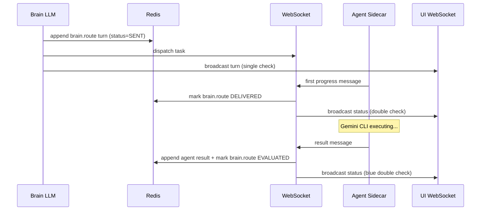

# Brain Event Loop Fixes + Message Status Protocol

## Deployment Strategy

Three waves, committed separately, based on Cynefin classification from preflight review:

- **Wave 1 (Clear):** Independent, zero-dependency, high-confidence fixes. Deploy first.
- **Wave 2 (Complicated):** Message status model + all code-level bug fixes. Known patterns, concurrency-aware.
- **Wave 3 (Complex/Probe):** System prompt changes only. Deploy last with 48hr sensing window.

## Architecture: Message Status Flow

### Inbound (Messages TO Brain)

```mermaid
sequenceDiagram
    participant Actor as User / Aligner / Agent
    participant Redis as Redis
    participant EventLoop as Brain EventLoop
    participant LLM as Brain LLM
    participant UI as UI WebSocket

    Actor->>Redis: append_turn(status=SENT)
    Actor->>UI: broadcast turn (single check)
    EventLoop->>Redis: scan active events
    EventLoop->>Redis: mark SENT turns to DELIVERED
    EventLoop->>UI: broadcast status (double check)
    Note over EventLoop: has_unread = any DELIVERED turns?
    EventLoop->>LLM: process_event (if has_unread)
    LLM->>Redis: mark all turns EVALUATED
    LLM->>UI: broadcast status (blue double check)
```


### Outbound (Brain routing TO Agents)




### Event Loop Re-Processing Trigger

The old last-turn condition matching is replaced by an unread-message scan:

```python
# OLD (fragile -- depends on specific actor/action combos):
if last_turn.actor in ("user", "aligner") and last_turn.action in (...):
    process_event(eid)
elif last_turn.actor in ("architect", "sysadmin", "developer"):
    process_event(eid)

# NEW (status-driven -- any DELIVERED turn triggers processing):
has_unread = any(t.status.value == "delivered" for t in event.conversation)
if has_unread:
    process_event(eid)
```

No loop risk: `process_event` marks all turns EVALUATED, so next scan finds zero DELIVERED turns.

---

## Wave 1: Independent High-Confidence Fixes

Two independent changes with zero dependencies on each other or on the message status model.

### W1-A. Event loop sleep (M-1 from initial review)

**File:** [src/agents/brain.py](src/agents/brain.py) -- `start_event_loop()` (line ~1231)

Add `await asyncio.sleep(1)` at the end of the `while self._running` loop body (after the try block, before the next iteration). Prevents tight spinning when there are many active events.

### W1-B. Bug 1 (Critical): Fix `re_trigger_aligner` service arg ignored

**File:** [src/agents/brain.py](src/agents/brain.py) -- `_execute_function_call()` (line ~770)

Store the target service on the turn so the Aligner can use it:

```python
elif function_name == "re_trigger_aligner":
    service = args.get("service", "")
    condition = args.get("check_condition", "")
    turn = ConversationTurn(
        turn=(await self._next_turn_number(event_id)),
        actor="brain",
        action="verify",
        thoughts=f"Re-triggering Aligner to check: {condition}",
        waitingFor="aligner",
        evidence=f"target_service:{service}",  # Store target service
    )
```

**File:** [src/agents/aligner.py](src/agents/aligner.py) -- `check_active_verifications()` (line ~913)

Parse the target service from the evidence field:

```python
# Extract target service from verify turn (falls back to event.service)
target_service = event.service
if last_turn.evidence and last_turn.evidence.startswith("target_service:"):
    target_service = last_turn.evidence.split(":", 1)[1]
svc = await self.blackboard.get_service(target_service)
```

---

## Wave 2: Message Status Model + Code-Level Bug Fixes

### W2-A. Add `MessageStatus` enum and `status` field to `ConversationTurn`

**File:** [src/models.py](src/models.py)

- Add `MessageStatus` enum above `ConversationTurn` (line ~303):
  ```python
  class MessageStatus(str, Enum):
      SENT = "sent"
      DELIVERED = "delivered"
      EVALUATED = "evaluated"
  ```
- Add `status` field to `ConversationTurn` (line ~324):
  ```python
  status: MessageStatus = MessageStatus.SENT
  ```

### W2-B. Add status mutation methods to BlackboardState

**File:** [src/state/blackboard.py](src/state/blackboard.py)

Add three new methods using `WATCH/MULTI/EXEC` (same pattern as `append_turn`):

- `mark_turns_delivered(event_id, up_to_turn)` -- sets all `SENT` turns to `DELIVERED`
- `mark_turns_evaluated(event_id)` -- sets all turns to `EVALUATED`
- `mark_turn_status(event_id, turn_number, status)` -- update a single turn's status (for agent-side tracking of brain.route turns)

All methods should return the count of turns updated (for logging) and be no-ops if nothing changed (avoid unnecessary Redis writes).

### W2-C. Bug 6 (Critical): Brain acknowledges turns during active agent tasks

**File:** [src/agents/brain.py](src/agents/brain.py) -- `start_event_loop()` (line ~1194)

Current code hard-skips events with active tasks. Change to a two-phase scan:

**Before (current):**

```python
if eid in self._active_tasks and not self._active_tasks[eid].done():
    continue
```

**After:**

```python
if eid in self._active_tasks and not self._active_tasks[eid].done():
    # Phase 1: Still acknowledge new turns (SENT -> DELIVERED)
    event = await self.blackboard.get_event(eid)
    if event:
        unseen = [t for t in event.conversation if t.status.value == "sent"]
        if unseen:
            await self.blackboard.mark_turns_delivered(eid, len(event.conversation))
            await self._broadcast_status_update(eid, unseen, "delivered")
    continue  # Still skip LLM evaluation -- agent is running
```

This preserves the "don't re-dispatch" safety but restores the feedback loop awareness.

### W2-D. Event loop: mark DELIVERED + unread-message scan (replaces old last-turn conditions)

**File:** [src/agents/brain.py](src/agents/brain.py) -- `start_event_loop()` (line ~1199)

Replace the old last-turn condition matching with a status-driven scan:

```python
event = await self.blackboard.get_event(eid)
if not event or not event.conversation:
    continue

# Mark all SENT turns as DELIVERED (Brain has seen them)
unseen = [t for t in event.conversation if t.status.value == "sent"]
if unseen:
    await self.blackboard.mark_turns_delivered(eid, len(event.conversation))
    await self._broadcast_status_update(eid, unseen, "delivered")

# Re-process if there are DELIVERED (unread) turns the Brain hasn't evaluated
has_unread = any(t.status.value == "delivered" for t in event.conversation)
if has_unread:
    await self.process_event(eid)
```

This replaces the old fragile conditions:

```python
# REMOVED -- these are superseded by the unread-message scan:
# if last_turn.actor in ("user", "aligner") and last_turn.action in (...):
# elif last_turn.actor in ("architect", "sysadmin", "developer"):
```

The idle safety net (W2-H, H5) applies as a fallback when no unread turns exist -- pure state/timer check, no content inspection.

### W2-E. Mark turns as EVALUATED after LLM call

**File:** [src/agents/brain.py](src/agents/brain.py) -- `process_event()` (line ~456)

After the LLM loop completes, mark all turns as `EVALUATED`:

```python
# After LLM loop exits:
await self.blackboard.mark_turns_evaluated(event_id)
await self._broadcast_status_update(event_id, None, "evaluated")
```

### W2-F. Add `_broadcast_status_update` helper

**File:** [src/agents/brain.py](src/agents/brain.py)

Accepts both `ConversationTurn` lists and raw `int` lists cleanly:

```python
async def _broadcast_status_update(
    self, event_id: str, status: str, turns=None,
) -> None:
    """Broadcast message status change to UI.
    
    Args:
        event_id: Event ID
        status: "delivered" or "evaluated"
        turns: list of ConversationTurn objects, list of int turn numbers,
               or None for "all"
    """
    if self.broadcast:
        if turns is None:
            turn_list = "all"
        elif turns and hasattr(turns[0], "turn"):
            turn_list = [t.turn for t in turns]
        else:
            turn_list = turns  # Already int list
        await self.broadcast({
            "type": "message_status",
            "event_id": event_id,
            "status": status,
            "turns": turn_list,
        })
```

### W2-F2. Bidirectional agent status: track Brain's outgoing turns

**File:** [src/agents/brain.py](src/agents/brain.py) -- `_run_agent_task()` (line ~868)

Track the Brain's routing turn number so the agent progress/result can update its status.

In `_execute_function_call` for `select_agent` / `ask_agent_for_state` (line ~679), after appending the brain.route turn, pass the turn number to `_run_agent_task`:

```python
task_coro = self._run_agent_task(
    event_id, agent_name, agent, task, event_md_path,
    routing_turn_num=turn.turn,  # NEW: track which turn this agent is responding to
)
```

In `_run_agent_task`, update the routing turn status based on agent signals:

```python
async def _run_agent_task(
    self, event_id, agent_name, agent, task, event_md_path,
    routing_turn_num: int = 0,  # NEW
) -> None:
    agent_acked = False  # Track first progress (= agent received task)

    async def on_progress(progress_data: dict) -> None:
        nonlocal agent_acked
        # First progress = agent received and is working (DELIVERED)
        if not agent_acked and routing_turn_num:
            agent_acked = True
            await self.blackboard.mark_turn_status(
                event_id, routing_turn_num, MessageStatus.DELIVERED
            )
            await self._broadcast_status_update(
                event_id, "delivered", turns=[routing_turn_num],
            )
        # ... existing progress broadcast ...

    # ... existing agent.process() call ...

    # After agent completes, mark routing turn as EVALUATED
    if routing_turn_num:
        await self.blackboard.mark_turn_status(
            event_id, routing_turn_num, MessageStatus.EVALUATED
        )
        await self._broadcast_status_update(
            event_id, "evaluated", turns=[routing_turn_num],
        )
```

No sidecar changes needed -- this uses existing WebSocket progress/result signals.

### W2-G. Bug 7 (Medium): Aligner dedup using message status

**File:** [src/agents/aligner.py](src/agents/aligner.py) -- `_notify_active_events()` (line ~942)

Before appending a confirm turn, check if a previous confirm is still unprocessed:

```python
# Check: is there a pending (SENT or DELIVERED) aligner confirm already?
pending = [
    t for t in event.conversation
    if t.actor == "aligner" and t.action == "confirm"
    and t.status.value in ("sent", "delivered")
]
if pending:
    logger.debug(f"Skipping confirm for {eid}: previous confirm not yet evaluated")
    continue
```

Same check in `check_active_verifications()` (line ~913).

### W2-H. Bug 5 (High): Add `wait_for_user` function + state-based idle safety net

Python = plumbing. No actor/action content inspection in the event loop. All decisions via LLM or explicit state tracking.

#### H1. `wait_for_user` tool declaration

**File:** [src/agents/brain.py](src/agents/brain.py) -- `_build_brain_tools()` (line ~155)

```python
wait_for_user = types.FunctionDeclaration(
    name="wait_for_user",
    description="Signal that the current question is answered but agent recommendations exist. "
                "Summarize findings and available next actions for the user.",
    parameters_json_schema={
        "type": "object",
        "properties": {
            "summary": {
                "type": "string",
                "description": "Summary of findings and available actions",
            },
        },
        "required": ["summary"],
    },
)
```

Add to tool list (line ~298).

#### H2. `wait_for_user` handler (state transition, not content creation)

**File:** [src/agents/brain.py](src/agents/brain.py) -- `_execute_function_call()`

```python
elif function_name == "wait_for_user":
    summary = args.get("summary", "")
    self._waiting_for_user.add(event_id)  # State flag (plumbing)
    turn = ConversationTurn(
        turn=(await self._next_turn_number(event_id)),
        actor="brain",
        action="wait",
        thoughts=summary,
        waitingFor="user",
    )
    await self.blackboard.append_turn(event_id, turn)
    await self._broadcast_turn(event_id, turn)
    return False
```

#### H3. State tracking in `Brain.__init__`

**File:** [src/agents/brain.py](src/agents/brain.py) -- `__init__()` (line ~335)

```python
self._waiting_for_user: set[str] = set()        # event IDs where LLM called wait_for_user
self._last_processed: dict[str, float] = {}      # event_id -> last process_event timestamp
```

#### H4. Clear `_waiting_for_user` when user sends a message

**File:** [src/main.py](src/main.py) -- WebSocket handler, `user_message` and `approve` branches

After appending the user turn, clear the waiting flag:

```python
# In the "user_message" branch (line ~274) and "approve" branch (line ~302):
if hasattr(app.state, 'brain'):
    app.state.brain._waiting_for_user.discard(event_id)
```

#### H5. Idle safety net (pure state-based, no content inspection)

**File:** [src/agents/brain.py](src/agents/brain.py) -- `start_event_loop()`, after the unread-message scan (W2-D)

```python
# After unread scan (W2-D):
if has_unread:
    await self.process_event(eid)
else:
    # Idle safety net: re-process if event has no active task,
    # is not waiting for user, and hasn't been processed recently.
    # Pure state/timer plumbing -- no actor/action content inspection.
    has_active_task = eid in self._active_tasks and not self._active_tasks[eid].done()
    is_waiting = eid in self._waiting_for_user
    time_since_process = time.time() - self._last_processed.get(eid, 0)
    if not has_active_task and not is_waiting and time_since_process > 240:
        logger.info(f"Idle safety net: re-processing event {eid} (idle {time_since_process:.0f}s)")
        await self.process_event(eid)
```

#### H6. Record `_last_processed` timestamp

**File:** [src/agents/brain.py](src/agents/brain.py) -- `process_event()` (top of method)

```python
self._last_processed[event_id] = time.time()
```

### W2-H2. Concurrency, migration, and CLOSED guard

These address gaps found in the pre-execution sweep.

#### Per-event lock (prevents concurrent `process_event` calls)

**File:** [src/agents/brain.py](src/agents/brain.py) -- `__init__()` (line ~335)

```python
from collections import defaultdict
self._event_locks: dict[str, asyncio.Lock] = defaultdict(asyncio.Lock)
```

**File:** [src/agents/brain.py](src/agents/brain.py) -- `process_event()` (line ~378)

Wrap the method body in a per-event lock:

```python
async def process_event(self, event_id: str) -> None:
    async with self._event_locks[event_id]:
        await self._process_event_inner(event_id)

async def _process_event_inner(self, event_id: str) -> None:
    self._last_processed[event_id] = time.time()
    # ... existing process_event body ...
```

#### CLOSED event guard

**File:** [src/agents/brain.py](src/agents/brain.py) -- top of `_process_event_inner()`

```python
event = await self.blackboard.get_event(event_id)
if not event:
    logger.warning(f"Event {event_id} not found")
    return
if event.status == EventStatus.CLOSED:
    logger.debug(f"Skipping closed event {event_id}")
    return
```

#### Migration step: mark existing turns as EVALUATED on startup

**File:** [src/agents/brain.py](src/agents/brain.py) -- `_cleanup_stale_events()` (line ~1114)

Add at the start of the method, before the existing stale event cleanup:

```python
# Migrate pre-MessageStatus events: mark all existing turns as EVALUATED
# to prevent mass re-processing on first deploy with the new unread-message scan.
active_ids = await self.blackboard.get_active_events()
for eid in active_ids:
    await self.blackboard.mark_turns_evaluated(eid)
logger.info(f"Startup migration: marked turns EVALUATED for {len(active_ids)} active events")
```

### W2-I. Bug 4 (Medium): Grace period + increased MAX_EVENT_DURATION

**File:** [src/agents/brain.py](src/agents/brain.py) -- constants (line ~144)

Increase timeout from 1800s (30 min) to 2700s (45 min):

```python
MAX_EVENT_DURATION_SECONDS = 2700  # 45 minutes
```

**File:** [src/agents/brain.py](src/agents/brain.py) -- `process_event()` (line ~426)

Add a grace period: if an agent result was appended in the last 60 seconds, extend the timeout:

```python
if event.conversation:
    first_turn_time = event.conversation[0].timestamp
    deadline = MAX_EVENT_DURATION_SECONDS

    # Grace period: if an agent just returned, give the LLM time to evaluate
    last_agent_turn = next(
        (t for t in reversed(event.conversation)
         if t.actor in ("architect", "sysadmin", "developer")),
        None,
    )
    if last_agent_turn and (time.time() - last_agent_turn.timestamp) < 60:
        deadline += 120  # 2-minute grace for LLM evaluation

    if time.time() - first_turn_time > deadline:
        ...force close...
```

### W2-J. Add TypeScript `MessageStatus` type and update `ConversationTurn`

**File:** [ui/src/api/types.ts](ui/src/api/types.ts)

- Add type: `export type MessageStatus = 'sent' | 'delivered' | 'evaluated';`
- Add to `ConversationTurn` interface (line ~147): `status?: MessageStatus;`

### W2-K. Render status indicators in ConversationFeed

**File:** [ui/src/components/ConversationFeed.tsx](ui/src/components/ConversationFeed.tsx)

Add a small status indicator per turn (single check / double check / blue double check). Handle `message_status` WebSocket messages to update turn status in real time.

---

## Wave 3: System Prompt Probes (48hr Sensing Window)

These are Complex domain changes -- LLM behavioral compliance is emergent. Deploy last with explicit success criteria.

### W3-A. Agent Recommendations clause (Bug 5 prompt component)

**File:** [src/agents/brain.py](src/agents/brain.py) -- `BRAIN_SYSTEM_PROMPT` (line ~37)

Add after "Decision Guidelines" section (~line 59):

```
## Agent Recommendations
- When an agent's response includes an explicit recommendation or unresolved issue, you MUST either:
  1. Act on it immediately (route to the recommended agent), OR
  2. Use wait_for_user to summarize findings and ask if the user wants you to proceed.
- NEVER silently drop an agent's recommendation.
```

**Success criteria (48hr):** Less than 5% of events where an agent includes a recommendation result in a stale `brain.think` with no follow-up action.

### W3-B. Non-metric verification guidance (Bug 2)

**File:** [src/agents/brain.py](src/agents/brain.py) -- `BRAIN_SYSTEM_PROMPT` (line ~67)

Replace the Post-Execution section with:

```
## Post-Execution: When to Close vs Verify
- After a **code change** (developer pushes a commit with SHA): wait for CI/CD, then route sysAdmin to verify the pod's image tag matches the commit SHA.
- After a **metric-observable infrastructure change** (scaling replicas, adjusting resource limits): use re_trigger_aligner to verify the new state.
- After a **non-metric config change** (removing secrets, updating annotations, labels, imagePullSecrets): route sysAdmin to verify via kubectl/oc (check events, pod YAML). Do NOT use re_trigger_aligner -- these changes are not observable via metrics.
- re_trigger_aligner is ONLY for metric-observable changes (replicas, CPU, memory).
```

**Success criteria (48hr):** Zero `re_trigger_aligner` calls for non-metric config changes (imagePullSecrets, annotations, labels).

---

## Files Changed Summary

- **Wave 1:** `src/agents/brain.py`, `src/agents/aligner.py`
- **Wave 2:** `src/models.py`, `src/state/blackboard.py`, `src/agents/brain.py`, `src/agents/aligner.py`, `src/main.py`, `ui/src/api/types.ts`, `ui/src/components/ConversationFeed.tsx`
- **Wave 3:** `src/agents/brain.py` (system prompt only)

