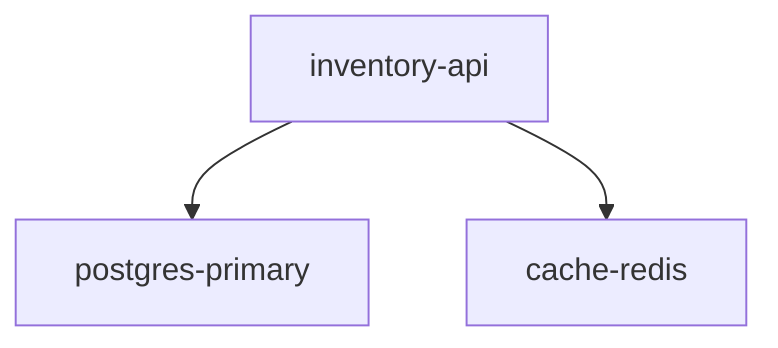

# Darwin Blackboard (Brain)

The central nervous system of Darwin - autonomous infrastructure management.

## Architecture

The Blackboard implements the **Blackboard Pattern** where agents never communicate directly:

```
┌─────────────────────────────────────────────────────────────┐
│                    Darwin Brain Pod                          │
│                                                              │
│  ┌──────────┐    ┌──────────────────────────────────────┐  │
│  │  Redis   │◄───│           Blackboard State            │  │
│  │ Sidecar  │    │  ┌────────┐ ┌────────┐ ┌────────┐   │  │
│  └──────────┘    │  │Structure│ │Metadata│ │ Plans  │   │  │
│                  │  │ Layer   │ │ Layer  │ │ Layer  │   │  │
│                  │  └────────┘ └────────┘ └────────┘   │  │
│                  └──────────────────────────────────────┘  │
│                           ▲         ▲         ▲            │
│                           │         │         │            │
│  ┌──────────┐    ┌──────────┐    ┌──────────┐            │
│  │ Aligner  │    │ Architect │    │ SysAdmin │            │
│  │ (Agent 1)│    │ (Agent 2) │    │ (Agent 3)│            │
│  └──────────┘    └──────────┘    └──────────┘            │
│       ▲               ▲               │                    │
└───────┼───────────────┼───────────────┼────────────────────┘
        │               │               │
        │               │               ▼
   [Telemetry]     [Chat API]      [Git Repo]
   from Store
```

## Trinity Agents

| Agent | Role | Nature | Input | Output |
|-------|------|--------|-------|--------|
| **Aligner** | Truth Maintenance | Hybrid (Python + AI Flash) | Telemetry | Updates Blackboard |
| **Architect** | Strategy | Pure AI (Vertex AI Pro) | Chat + Context | JSON Plans |
| **SysAdmin** | Execution | Hybrid (Python + Gemini CLI) | Approved Plans | Git Commits |

## Quick Start

### Local Development

```bash
# Start Redis
docker run -d --name redis -p 6379:6379 redis:7

# Install dependencies
cd BlackBoard
pip install -r requirements.txt

# Set environment variables
export REDIS_HOST=localhost
export GCP_PROJECT=your-project-id
export GCP_LOCATION=us-central1

# Run the server
uvicorn src.main:app --host 0.0.0.0 --port 8000 --reload
```

### Helm Deployment (OpenShift)

```bash
# Set GCP project
helm install darwin-brain ./helm \
  --set gcp.project=your-project-id \
  --set gcp.existingSecret=gcp-sa-key

# Verify
kubectl get pods -l app=darwin-brain
curl http://darwin-brain:8000/
```

## API Endpoints

### Health

```bash
GET /              # Returns {"status": "brain_online"}
GET /health        # Alternative health check
GET /info          # API information
```

### Telemetry (from Darwin Store)

```bash
POST /telemetry/
{
  "service": "inventory-api",
  "version": "v2.0",
  "metrics": {"cpu": 75.0, "memory": 60.0, "error_rate": 0.5},
  "topology": {
    "dependencies": [
      {"target": "postgres-primary", "type": "db", "env_var": "DATABASE_URL"}
    ]
  }
}
```

### Topology (Architecture Graph - Visualization #1)

```bash
GET /topology/           # JSON topology
GET /topology/mermaid    # Mermaid diagram
GET /topology/services   # List service names
```

### Plans

```bash
GET /plans/                  # List all plans
GET /plans/{id}              # Get plan details
POST /plans/{id}/approve     # Approve a pending plan
POST /plans/{id}/reject      # Reject a pending plan
POST /plans/{id}/execute     # Execute an approved plan
```

### Metrics (Resources Chart - Visualization #2)

```bash
GET /metrics/{service}          # Current metrics
GET /metrics/{service}/history  # Time-series history
GET /metrics/chart?services=svc1&services=svc2&range_seconds=3600
```

### Chat (Architect Interface)

```bash
POST /chat/
{"message": "Scale inventory-api to 3 replicas"}

# Response:
{
  "message": "I've created a plan (plan-abc123) for scaling inventory-api...",
  "plan_id": "plan-abc123"
}
```

## Two Key Visualizations

### 1. Architecture Graph

Real-time topology of services and their dependencies.

```bash
curl http://localhost:8000/topology/mermaid
```

Returns Mermaid graph:


### 2. Resources Consumption Chart

Time-series metrics correlated with architecture events.

```bash
curl "http://localhost:8000/metrics/chart?services=inventory-api&range_seconds=3600"
```

Returns:
```json
{
  "series": [
    {"service": "inventory-api", "metric": "cpu", "data": [[timestamp, value], ...]},
    {"service": "inventory-api", "metric": "memory", "data": [...]}
  ],
  "events": [
    {"type": "plan_executed", "timestamp": 1234567890, "details": {"action": "scale"}}
  ]
}
```

## Configuration

### Environment Variables

| Variable | Description | Default |
|----------|-------------|---------|
| `REDIS_HOST` | Redis hostname | `localhost` |
| `REDIS_PASSWORD` | Redis password | (empty) |
| `GCP_PROJECT` | GCP project ID | (required) |
| `GCP_LOCATION` | Vertex AI location | `us-central1` |
| `VERTEX_MODEL_PRO` | Architect model | `gemini-3-pro-preview` |
| `VERTEX_MODEL_FLASH` | Aligner model | `gemini-3-flash-preview` |
| `SYSADMIN_DRY_RUN` | Dry run mode | `true` |
| `SYSADMIN_AUTO_APPROVE` | Auto-approve CLI actions | `false` |
| `DEBUG` | Enable debug logging | `false` |

## Air Gap Constraints

Per the architecture rules, agents have import restrictions:

| Agent | CAN Import | CANNOT Import |
|-------|------------|---------------|
| Aligner | redis, vertexai | kubernetes, git |
| Architect | redis, vertexai | kubernetes, git, subprocess |
| SysAdmin | redis, subprocess | vertexai |

## Safety Features

The SysAdmin includes a safety decorator that blocks dangerous operations:

- `rm -rf`
- `kubectl delete namespace`
- `git push --force`
- `drop database`
- etc.

See `agents/sysadmin.py` for the full list.

## License

See [LICENSE](LICENSE) file.
