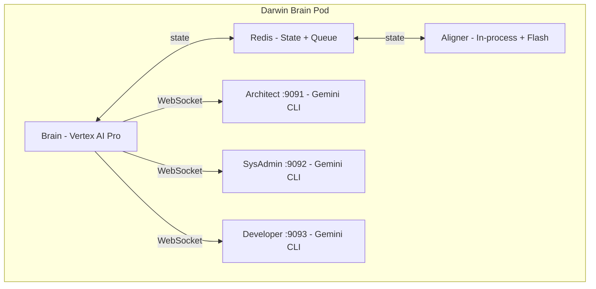

# Darwin Blackboard (Brain)

The central nervous system of Darwin -- an autonomous closed-loop cloud operations system.

## Architecture

The Brain orchestrates multi-agent conversations via the **Blackboard Pattern** with bidirectional WebSocket communication:



## Agents

| Agent          | Role              | Technology                         | Capabilities                                                      |
| -------------- | ----------------- | ---------------------------------- | ----------------------------------------------------------------- |
| **Brain**      | Orchestrator      | Vertex AI Pro (Gemini 3 Pro, >0.7) | Cynefin classification, agent routing, feedback loop verification |
| **Aligner**    | Truth Maintenance | In-process Python + Vertex AI Flash| Telemetry processing, LLM signal analysis, event creation         |
| **Architect**  | Strategy          | Gemini CLI sidecar                 | Code review, Markdown plans, risk assessment. NEVER executes.     |
| **sysAdmin**   | Execution         | Gemini CLI sidecar                 | GitOps changes, kubectl/oc investigation, ArgoCD/Kargo management |
| **Developer**  | Implementation    | Gemini CLI sidecar                 | Source code changes, feature implementation, bug fixes            |

## Sidecar CLI Toolkit

All three sidecar agents share the same base image with these CLIs pre-installed (latest/stable, no pinned versions):

| CLI      | Purpose                                | Auth                                     |
| -------- | -------------------------------------- | ---------------------------------------- |
| `git`    | GitOps clone, modify, commit, push     | GitHub App token (auto-configured)       |
| `kubectl`| K8s investigation (get, describe, logs)| Pod ServiceAccount                       |
| `oc`     | OpenShift CLI (superset of kubectl)    | Pod ServiceAccount                       |
| `argocd` | ArgoCD app status, sync, diff          | Admin password (Architect + SysAdmin)    |
| `kargo`  | Kargo projects, stages, promotions     | Admin password (Architect + SysAdmin)    |
| `tkn`    | Tekton pipelines, runs, logs           | Pod ServiceAccount                       |
| `helm`   | Chart validation (template, lint)      | N/A                                      |
| `jq`     | JSON processing                        | N/A                                      |
| `yq`     | YAML processing                        | N/A                                      |
| `curl`   | HTTP requests, health checks           | N/A (baked in UBI9)                      |

ArgoCD and Kargo credentials are mounted only on Architect and SysAdmin sidecars. The Developer sidecar has git + code tools only. See [docs/README.md](docs/README.md) for credential setup.

## Key Features

- **Conversation Queue** -- Shared event documents in Redis with append-only conversation turns
- **WebSocket Communication** -- Real-time bidirectional streaming between Brain, agents, and UI
- **Cynefin Decision Framework** -- Brain classifies events into Clear/Complicated/Complex/Chaotic domains
- **LLM Signal Analysis** -- Aligner uses Flash to interpret metrics patterns via a unified buffered pipeline (not hardcoded thresholds)
- **GitOps-Only Mutations** -- All changes go through git (clone, modify, push). kubectl is read-only.
- **Event Dedup + Defer** -- Prevents event spam, supports deferred re-processing with configurable delays
- **Closed-Loop Verification** -- Brain verifies every change via Aligner before closing events
- **ArgoCD/Kargo Integration** -- Agents can inspect ArgoCD sync status, trigger syncs, and read Kargo promotion pipelines
- **Cross-Event Correlation** -- Brain sees all active events for the same service, avoids conflicting actions during rollouts
- **Multimodal Chat** -- Users can paste/upload images in chat and rejection reasons; Brain processes images via Gemini's multimodal API
- **Agent Streaming Cards** -- Real-time per-agent Gemini CLI stdout displayed in dedicated UI cards with pop-out floating windows
- **Plan Viewer** -- Architect plans rendered as collapsible Markdown cards with full floating-window viewer
- **Service Lookup** -- Brain has a `lookup_service` function to query service metadata (GitOps repo, version, metrics) from the Blackboard
- **Per-Agent Models** -- Each sidecar runs a different Gemini model optimized for its role (Pro for Architect, Flash for SysAdmin, 2.5 Pro for Developer)

## Autonomous Remediation Examples

- [Over-Provisioned Scale-Down](docs/autonomous-remediation-example.md) -- 21-turn event: Detected over-provisioned service, discovered GitOps repo by reasoning from container image URL, scaled down via GitOps, verified outcome.
- [OOMKilled Recovery](docs/oom-killed-remediation-example.md) -- 10-turn event: Detected OOMKilled pod, confirmed root cause via SysAdmin, increased memory limits via GitOps as preventive fix, verified recovery through Aligner.

## SDK

The Brain and Aligner use the `google-genai` SDK (replacing the deprecated `vertexai.generative_models` module). The sidecar agents use the Gemini CLI with Vertex AI backend (`GOOGLE_GENAI_USE_VERTEXAI=true`).

| Component         | SDK                       | Model                    |
| ----------------- | ------------------------- | ------------------------ |
| Brain             | `google-genai` Python SDK | `gemini-3-pro-preview`   |
| Aligner           | `google-genai` Python SDK | `gemini-3-flash-preview` |
| Architect sidecar | Gemini CLI                | `gemini-3-pro-preview`   |
| SysAdmin sidecar  | Gemini CLI                | `gemini-3-flash-preview` |
| Developer sidecar | Gemini CLI                | `gemini-2.5-pro`         |

## Quick Start

### Local Development

```bash
# Start Redis
docker run -d --name redis -p 6379:6379 redis:7

# Install dependencies
pip install -r requirements.txt

# Set environment variables
export REDIS_HOST=localhost
export GCP_PROJECT=your-project-id
export GCP_LOCATION=us-central1

# Run the server
uvicorn src.main:app --host 0.0.0.0 --port 8000 --reload
```

### Helm Deployment (OpenShift)

```bash
helm install darwin-brain ./helm \
  --set gcp.project=your-project-id \
  --set gcp.existingSecret=gcp-sa-key

# Verify -- should show 5 containers (brain, redis, architect, sysadmin, developer)
kubectl get pods -l app=darwin-brain
```

## API Endpoints

### Health & Info

```text
GET /health         # {"status": "brain_online"}
GET /info           # API information and available endpoints
```

### WebSocket (Real-time UI)

```text
WS /ws              # Bidirectional WebSocket for live conversation updates
                    # Receives: turn, progress, event_created, event_closed, attachment
                    # Sends: chat, approve, reject, user_message
```

### Conversation Queue

```text
GET  /queue/active             # List active events with metadata
GET  /queue/{event_id}         # Full event document with conversation
POST /queue/{event_id}/approve # Approve a pending plan
POST /queue/{event_id}/reject  # Reject a pending plan with reason
GET  /queue/closed/list        # Recently closed events
```

### Chat

```json
POST /chat/
{"message": "Scale darwin-store to 3 replicas", "service": "darwin-store"}

// Response:
{"event_id": "evt-abc123", "status": "created"}
// Brain processes asynchronously -- track via WebSocket or GET /queue/{event_id}
```

### Telemetry

```json
POST /telemetry/
{
  "service": "darwin-store",
  "version": "v52",
  "metrics": {"cpu": 75.0, "memory": 60.0, "error_rate": 0.5},
  "topology": {"dependencies": [{"target": "postgres", "type": "db"}]},
  "gitops": {"repo": "The-Darwin-Project/Store", "helm_path": "helm/values.yaml"}
}
```

### Topology & Metrics

```text
GET /topology/                 # JSON topology
GET /topology/graph            # Cytoscape.js graph data
GET /topology/mermaid          # Mermaid diagram
GET /metrics/{service}         # Current metrics
GET /metrics/chart             # Time-series chart data
GET /events/                   # Architecture event timeline
```

## Configuration

### Environment Variables

| Variable                | Description          | Default                  |
| ----------------------- | -------------------- | ------------------------ |
| `REDIS_HOST`            | Redis hostname       | `localhost`              |
| `REDIS_PASSWORD`        | Redis password       | (empty)                  |
| `GCP_PROJECT`           | GCP project ID       | (required)               |
| `GCP_LOCATION`          | Vertex AI location   | `global`                 |
| `VERTEX_MODEL_PRO`      | Brain model          | `gemini-3-pro-preview`   |
| `VERTEX_MODEL_FLASH`    | Aligner model        | `gemini-3-flash-preview` |
| `ARCHITECT_SIDECAR_URL` | Architect WebSocket  | `http://localhost:9091`  |
| `SYSADMIN_SIDECAR_URL`  | sysAdmin WebSocket   | `http://localhost:9092`  |
| `DEVELOPER_SIDECAR_URL` | Developer WebSocket  | `http://localhost:9093`  |
| `DEBUG`                 | Enable debug logging | `false`                  |

## Safety

### Air Gap (Soft Enforcement via GEMINI.md)

| Agent     | Can Do                                                            | Cannot Do                                       |
| --------- | ----------------------------------------------------------------- | ----------------------------------------------- |
| Architect | Clone + read repos, argocd/kargo read, oc read                    | Commit, push, kubectl mutations, argocd sync    |
| sysAdmin  | Git clone/push, kubectl/oc read, argocd sync, kargo read, helm    | kubectl write, invent Helm sections             |
| Developer | Git clone/push, read Helm, read code                              | Modify infrastructure, kubectl scale, argocd    |

### Security Patterns

- `FORBIDDEN_PATTERNS` in `security.py` blocks: `rm -rf`, `drop database`, `kubectl delete namespace`, `git push --force`, etc.
- Dockerfile safety rules: agents can add `ARG/ENV/COPY/RUN` but cannot change `FROM/CMD/USER/WORKDIR`
- Structural changes require user approval (Brain pauses for confirmation)
- Agent concurrency locks prevent WebSocket `recv` conflicts (Brain-side per-agent locks + client-side defense-in-depth)
- ArgoCD/Kargo passwords masked in logs via `stdio: ['pipe', 'pipe', 'pipe']`

## Project Structure

```text
BlackBoard/
  src/
    agents/
      brain.py          # Brain orchestrator (Vertex AI Pro, function calling)
      aligner.py        # Aligner (telemetry, anomaly detection, Flash)
      base_client.py    # Shared WebSocket agent client base class
      architect.py      # Thin subclass (10 lines)
      sysadmin.py       # Thin subclass (10 lines)
      developer.py      # Thin subclass (10 lines)
    state/
      blackboard.py     # Redis state management (event queue, metrics, topology)
    routes/
      queue.py          # Event queue API (approve, reject, list)
      chat.py           # Chat endpoint
      events.py         # Architecture event timeline
    models.py           # Pydantic models (EventDocument, ConversationTurn)
    main.py             # FastAPI app, WebSocket endpoint, lifespan
  gemini-sidecar/
    Dockerfile          # Sidecar image (Node.js 22, CLI toolkit)
    server.js           # HTTP + WebSocket wrapper for Gemini CLI
    rules/              # GEMINI.md files per agent (architect, sysadmin, developer)
  helm/
    values.yaml         # Helm values (sidecars, GCP, ArgoCD, Kargo)
    templates/          # Deployment, RBAC, secrets, ConfigMaps
    files/              # GEMINI.md copies for Helm .Files.Get
  ui/
    src/
      components/       # React components (Dashboard, ConversationFeed, AgentStreamCard)
      contexts/         # WebSocketContext provider
      hooks/            # TanStack Query hooks (useQueue, useChat, useWebSocket)
      api/              # API client + TypeScript types
  docs/                 # External service access docs, remediation examples
  manifests/            # Standalone K8s manifests (README only, SAs in GitOps repos)
```

## License

See [LICENSE](LICENSE) file.
