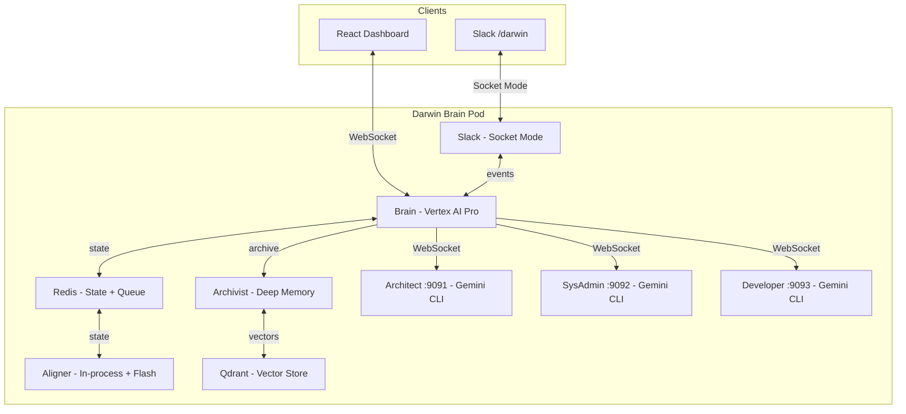

# Darwin Blackboard (Brain)

The central nervous system of Darwin -- an autonomous closed-loop cloud operations system.

## Architecture

The Brain orchestrates multi-agent conversations via the **Blackboard Pattern** with bidirectional WebSocket communication across Dashboard and Slack:



## Agents

| Agent          | Role              | Technology                         | Capabilities                                                      |
| -------------- | ----------------- | ---------------------------------- | ----------------------------------------------------------------- |
| **Brain**      | Orchestrator      | Vertex AI Pro (Gemini 3 Pro)       | Cynefin classification, progressive skill loading, agent routing, feedback loop verification |
| **Aligner**    | Truth Maintenance | In-process Python + Vertex AI Flash| Telemetry processing, LLM signal analysis, anomaly-triggered event creation |
| **Archivist**  | Deep Memory       | In-process Python + Flash          | Event summarization, vector embedding (text-embedding-005), similarity search via Qdrant |
| **Architect**  | Strategy          | Gemini CLI sidecar                 | Code review, structured plans with frontmatter YAML, risk assessment. NEVER executes. |
| **SysAdmin**   | Execution         | Gemini CLI sidecar                 | GitOps changes, kubectl/oc investigation, ArgoCD/Kargo management |
| **Developer**  | Implementation    | Gemini CLI sidecar (team: Dev + QE + Manager) | Source code changes, feature implementation, QE verification, manager review |

## Progressive Skill System

The Brain loads phase-specific skills (Markdown files) based on event state, replacing the monolithic system prompt. Skills are organized into phases with dependency resolution:

```text
src/agents/brain_skills/
  always/         # Core identity, function rules, safety, control theory (loaded every call)
  triage/         # Cynefin classification, deep memory consultation (early turns)
  dispatch/       # Execution method, GitOps context (routing phase)
  post-agent/     # Plan activation, recommendations, when-to-close (after agent returns)
  waiting/        # Wait-for-user protocol (when paused for human input)
  context/        # Cross-event awareness, architecture diagram, aligner observations
  source/         # Source-specific rules (slack, chat, aligner)
  multi-user/     # Multi-participant conversation protocol
```

Each phase has a `_phase.yaml` with LLM parameters (thinking_level, temperature, priority). The `BrainSkillLoader` in `brain_skill_loader.py` handles discovery, frontmatter parsing, dependency resolution (BFS with cycle detection), and template variable substitution.

Phase exclusions prevent conflicting skills from loading simultaneously (e.g., `post-agent` excludes `triage` and `dispatch`).

## Structured Plan Tracking

The Architect produces plans with a frontmatter YAML header for machine-readable step tracking:

```yaml
---
plan: Replace Native Confirm with Bootstrap Modal
service: darwin-store
repository: https://github.com/The-Darwin-Project/Store.git
domain: CLEAR
risk: low
steps:
  - id: 1
    agent: developer
    mode: implement
    summary: "Add modal HTML and JS function"
    status: pending
  - id: 2
    agent: developer
    mode: implement
    summary: "Update onclick handlers"
    status: pending
---
```

The Brain reads the frontmatter `steps:` array, batches same-agent steps, and dispatches with the correct mode. The Developer team's Manager uses the frontmatter as a work tracker, updating `status` as steps complete. When `mode: implement` is used, the full team activates (Developer + QE + Manager).

## Slack Integration

Full bidirectional Slack integration via Socket Mode (`src/channels/slack.py`):

- **`/darwin` slash command** -- Creates events from Slack, mirrors Brain conversation to the thread
- **DM notifications** -- Brain calls `notify_user_slack(email, message)` to send targeted DMs
- **Bidirectional threads** -- Recipients can reply in-thread; replies route back to the event conversation
- **Source tagging** -- Every message is tagged with its origin (dashboard, slack) for Brain context
- **Approve/reject via reactions** -- Thumbs up/down on plan messages
- **Thinking indicators** -- Custom emoji shown while the Brain processes, replaced with the final result
- **Thread ownership guard** -- Prevents notification DMs from hijacking existing event threads

## Deep Memory (Archivist)

The Archivist (`src/agents/archivist.py`) archives closed events into a Qdrant vector store for institutional memory:

1. On event closure, summarizes the event via Flash LLM (symptom, root cause, fix, keywords)
2. Embeds the summary using `text-embedding-005` (768 dimensions)
3. Stores in Qdrant collection `darwin_events` with service/domain metadata
4. Brain calls `consult_deep_memory()` before routing -- if a past event scores > 0.6 similarity, it skips investigation and acts on the prior fix

The `VectorStore` class (`src/memory/vector_store.py`) is a lightweight async Qdrant REST wrapper (no SDK dependency).

## Sidecar CLI Toolkit

All three sidecar agents share the same base image with these CLIs pre-installed:

| CLI      | Purpose                                | Auth                                     |
| -------- | -------------------------------------- | ---------------------------------------- |
| `git`    | GitOps clone, modify, commit, push     | GitHub App token + GitLab PAT            |
| `kubectl`| K8s investigation (get, describe, logs)| Pod ServiceAccount                       |
| `oc`     | OpenShift CLI (superset of kubectl)    | Pod ServiceAccount                       |
| `argocd` | ArgoCD app status, sync, diff          | Admin password (Architect + SysAdmin)    |
| `kargo`  | Kargo projects, stages, promotions     | Admin password (Architect + SysAdmin)    |
| `tkn`    | Tekton pipelines, runs, logs           | Pod ServiceAccount                       |
| `helm`   | Chart validation (template, lint)      | N/A                                      |
| `gh`     | GitHub CLI (PRs, issues, releases)     | GitHub App token                         |
| `glab`   | GitLab CLI (MRs, pipelines, API)       | GitLab PAT                               |
| `jq`/`yq`| JSON/YAML processing                  | N/A                                      |

Each sidecar also has 12 agent skills (`gemini-sidecar/skills/`) loaded automatically based on task context (plan template, code review, GitOps workflow, investigation, rollback, etc.).

## Key Features

- **Progressive Skill Loading** -- Phase-specific Markdown skills with dependency resolution, replacing monolithic prompts
- **Conversation Queue** -- Shared event documents in Redis with append-only conversation turns
- **WebSocket Communication** -- Real-time bidirectional streaming between Brain, agents, Dashboard, and Slack
- **Cynefin Decision Framework** -- Brain classifies events into Clear/Complicated/Complex/Chaotic domains
- **Deep Memory** -- Qdrant vector store for past event recall and pattern matching
- **Structured Plan Tracking** -- Frontmatter YAML step assignments with team-level status tracking
- **Cross-Platform Chat** -- Dashboard and Slack as unified event interfaces with source-aware behavior
- **LLM Signal Analysis** -- Aligner uses Flash to interpret metrics patterns (anomaly-triggered, not polling-based)
- **GitOps-Only Mutations** -- All changes go through git. kubectl is read-only.
- **Agent Recommendation Injection** -- Agent recommendations promoted to system-level priority with temporal context
- **Event Dedup + Defer** -- Prevents event spam, supports deferred re-processing up to 60 minutes
- **Closed-Loop Verification** -- Brain verifies every change via Aligner before closing events
- **ArgoCD/Kargo Integration** -- Agents inspect sync status, trigger syncs, read Kargo promotion pipelines
- **Cross-Event Correlation** -- Brain sees all active events for the same service, avoids conflicting actions
- **Multimodal Chat** -- Users can paste/upload images; Brain processes via Gemini multimodal API
- **Agent Streaming Cards** -- Real-time per-agent Gemini CLI stdout in dedicated UI cards with floating windows
- **AI Transparency** -- All AI-generated messages tagged, user guide page, feedback mechanism
- **User Feedback** -- POST `/feedback` endpoint stores ratings in Qdrant for quality tracking
- **Auth Scaffolding** -- Dex OIDC identity ready (gated behind `DEX_ENABLED`, anonymous mode when off)

## Autonomous Remediation Examples

- [Over-Provisioned Scale-Down](docs/autonomous-remediation-example.md) -- 21-turn event: Detected over-provisioned service, discovered GitOps repo by reasoning from container image URL, scaled down via GitOps, verified outcome.
- [OOMKilled Recovery](docs/oom-killed-remediation-example.md) -- 10-turn event: Detected OOMKilled pod, confirmed root cause via SysAdmin, increased memory limits via GitOps as preventive fix, verified recovery through Aligner.

## SDK

The Brain and Aligner use the `google-genai` SDK. The sidecar agents use the Gemini CLI with Vertex AI backend.

| Component         | SDK                       | Model                    |
| ----------------- | ------------------------- | ------------------------ |
| Brain             | `google-genai` Python SDK | `gemini-3-pro-preview`   |
| Aligner           | `google-genai` Python SDK | `gemini-3-flash-preview` |
| Archivist         | `google-genai` Python SDK | `gemini-3-flash-preview` |
| Architect sidecar | Gemini CLI                | `gemini-3-pro-preview`   |
| SysAdmin sidecar  | Gemini CLI                | `gemini-3-flash-preview` |
| Developer sidecar | Gemini CLI                | `gemini-2.5-pro`         |

## Quick Start

### Local Development

```bash
# Start Redis
docker run -d --name redis -p 6379:6379 redis:7

# Install dependencies
pip install -r requirements.txt

# Set environment variables
export REDIS_HOST=localhost
export GCP_PROJECT=your-project-id
export GCP_LOCATION=us-central1

# Run the server
uvicorn src.main:app --host 0.0.0.0 --port 8000 --reload
```

### Helm Deployment (OpenShift)

```bash
helm install darwin-brain ./helm \
  --set gcp.project=your-project-id \
  --set gcp.existingSecret=gcp-sa-key

# Verify -- should show 7 containers (brain, redis, architect, sysadmin, developer, qe, manager)
kubectl get pods -l app=darwin-brain
```

## API Endpoints

### Health & Info

```text
GET /health         # {"status": "brain_online"}
GET /info           # API information and available endpoints
```

### WebSocket (Real-time UI)

```text
WS /ws              # Bidirectional WebSocket for live conversation updates
                    # Receives: turn, progress, event_created, event_closed, attachment
                    # Sends: chat, approve, reject, user_message
```

### Conversation Queue

```text
GET  /queue/active             # List active events with metadata
GET  /queue/{event_id}         # Full event document with conversation
POST /queue/{event_id}/approve # Approve a pending plan
POST /queue/{event_id}/reject  # Reject a pending plan with reason
GET  /queue/closed/list        # Recently closed events
```

### Chat

```json
POST /chat/
{"message": "Scale darwin-store to 3 replicas", "service": "darwin-store"}

// Response:
{"event_id": "evt-abc123", "status": "created"}
// Brain processes asynchronously -- track via WebSocket or GET /queue/{event_id}
```

### Feedback

```json
POST /feedback
{"event_id": "evt-abc123", "turn_number": 5, "rating": "positive", "comment": "Accurate fix"}
```

### Telemetry

```json
POST /telemetry/
{
  "service": "darwin-store",
  "version": "v52",
  "metrics": {"cpu": 75.0, "memory": 60.0, "error_rate": 0.5},
  "topology": {"dependencies": [{"target": "postgres", "type": "db"}]},
  "gitops": {"repo": "The-Darwin-Project/Store", "helm_path": "helm/values.yaml"}
}
```

### Topology & Metrics

```text
GET /topology/                 # JSON topology
GET /topology/graph            # Cytoscape.js graph data
GET /topology/mermaid          # Mermaid diagram
GET /metrics/{service}         # Current metrics
GET /metrics/chart             # Time-series chart data
GET /events/                   # Architecture event timeline
```

## Configuration

### Environment Variables

| Variable                | Description               | Default                  |
| ----------------------- | ------------------------- | ------------------------ |
| `REDIS_HOST`            | Redis hostname            | `localhost`              |
| `REDIS_PASSWORD`        | Redis password            | (empty)                  |
| `GCP_PROJECT`           | GCP project ID            | (required)               |
| `GCP_LOCATION`          | Vertex AI location        | `global`                 |
| `VERTEX_MODEL_PRO`      | Brain model               | `gemini-3-pro-preview`   |
| `VERTEX_MODEL_FLASH`    | Aligner/Archivist model   | `gemini-3-flash-preview` |
| `ARCHITECT_SIDECAR_URL` | Architect WebSocket       | `http://localhost:9091`  |
| `SYSADMIN_SIDECAR_URL`  | sysAdmin WebSocket        | `http://localhost:9092`  |
| `DEVELOPER_SIDECAR_URL` | Developer WebSocket       | `http://localhost:9093`  |
| `QDRANT_URL`            | Qdrant vector store       | `http://localhost:6333`  |
| `SLACK_BOT_TOKEN`       | Slack bot OAuth token     | (optional)               |
| `SLACK_APP_TOKEN`       | Slack app-level token     | (optional)               |
| `DEX_ENABLED`           | Enable Dex OIDC auth      | `false`                  |
| `BRAIN_PROGRESSIVE_SKILLS` | Enable progressive skills | `true`                |
| `DEBUG`                 | Enable debug logging      | `false`                  |

## Safety

### Air Gap (Soft Enforcement via GEMINI.md + Skills)

| Agent     | Can Do                                                            | Cannot Do                                       |
| --------- | ----------------------------------------------------------------- | ----------------------------------------------- |
| Architect | Clone + read repos, argocd/kargo read, oc read                    | Commit, push, kubectl mutations, argocd sync    |
| sysAdmin  | Git clone/push, kubectl/oc read, argocd sync, kargo read, helm    | kubectl write, invent Helm sections             |
| Developer | Git clone/push, read Helm, read code                              | Modify infrastructure, kubectl scale, argocd    |

### Security Patterns

- `FORBIDDEN_PATTERNS` in `security.py` blocks: `rm -rf`, `drop database`, `kubectl delete namespace`, `git push --force`, etc.
- Dockerfile safety rules: agents can add `ARG/ENV/COPY/RUN` but cannot change `FROM/CMD/USER/WORKDIR`
- Structural changes require user approval (Brain pauses for confirmation)
- Agent concurrency locks prevent WebSocket `recv` conflicts
- ArgoCD/Kargo passwords masked in logs
- AI-generated content tagged in both Dashboard and Slack interfaces

## Project Structure

```text
BlackBoard/
  src/
    agents/
      brain.py              # Brain orchestrator (Vertex AI Pro, function calling, progressive skills)
      brain_skill_loader.py  # Filesystem-driven skill discovery, YAML frontmatter, dependency resolution
      brain_skills/          # Phase-organized Markdown skills (always, triage, dispatch, post-agent, etc.)
      aligner.py             # Aligner (telemetry, anomaly-triggered detection, Flash)
      archivist.py           # Deep Memory (event summarization, vector embedding, Qdrant storage)
      base_client.py         # Shared WebSocket agent client base class
      architect.py           # Thin subclass
      sysadmin.py            # Thin subclass
      developer.py           # Thin subclass
      llm/
        gemini_client.py     # Gemini API client (streaming, thought_signature handling)
        types.py             # Function declarations for Brain tools
    channels/
      slack.py               # Slack Socket Mode integration (slash commands, DMs, threads)
    memory/
      vector_store.py        # Async Qdrant REST wrapper (no SDK dependency)
    state/
      blackboard.py          # Redis state management (event queue, metrics, topology)
    routes/
      queue.py               # Event queue API (approve, reject, list)
      chat.py                # Chat endpoint
      events.py              # Architecture event timeline
      feedback.py            # AI response quality feedback (stored in Qdrant)
      metrics.py             # Service metrics endpoints
      topology.py            # Topology graph and Mermaid diagram
      telemetry.py           # Telemetry ingestion from services
      reports.py             # Reports SPA serving
    models.py                # Pydantic models (EventDocument, ConversationTurn, PlanStep)
    auth.py                  # Dex OIDC scaffolding (gated behind DEX_ENABLED)
    main.py                  # FastAPI app, WebSocket endpoint, lifespan
  gemini-sidecar/
    Dockerfile               # Sidecar image (Node.js 22, CLI toolkit)
    server.js                # HTTP + WebSocket wrapper for Gemini/Claude CLI
    rules/                   # Agent constitution files (architect.md, sysadmin.md, developer.md, qe.md)
    skills/                  # 12 agent skills (plan-template, code-review, gitops, investigate, etc.)
  helm/
    values.yaml              # Helm values (sidecars, GCP, ArgoCD, Kargo, Slack, observer thresholds)
    templates/               # Deployment, RBAC, secrets, ConfigMaps, PVC
    files/                   # Agent rule copies for Helm .Files.Get
  ui/
    src/
      components/            # 25 React components (Dashboard, ConversationFeed, AgentStreamCard, Reports, etc.)
      contexts/              # WebSocketContext provider
      hooks/                 # TanStack Query hooks (useQueue, useChat, useWebSocket)
      api/                   # API client + TypeScript types
  docs/                      # External service access docs, remediation examples
```

## License

See [LICENSE](LICENSE) file.
