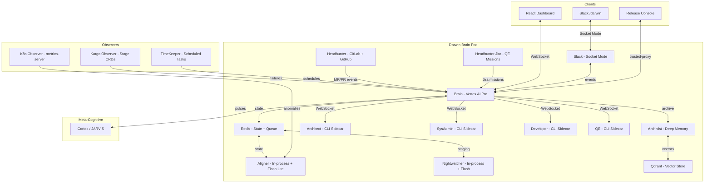

<!-- @ai-rules:
1. [Constraint]: This is the concise overview. Detailed content lives in docs/*.md. Do not duplicate.
2. [Pattern]: Keep under 200 lines. Link to sub-docs for details.
3. [Constraint]: No internal hostnames, emails, or credentials. Open-source hygiene.
4. [Gotcha]: The mermaid diagram must match docs/architecture.md topology.
-->
# Darwin Blackboard (Brain)

[](LICENSE)
[](https://github.com/The-Darwin-Project/Blackboard/actions/workflows/build-push.yaml)
[](https://github.com/The-Darwin-Project/Blackboard/actions/workflows/ai-review.yaml)

The central nervous system of Darwin -- an autonomous closed-loop cloud operations system.

> **Contributing?** See [CONTRIBUTING.md](CONTRIBUTING.md) for development setup. Report security issues via [SECURITY.md](SECURITY.md). Community standards in [CODE_OF_CONDUCT.md](CODE_OF_CONDUCT.md).

## Architecture

The Brain orchestrates multi-agent conversations via the **Blackboard Pattern** with bidirectional WebSocket communication across Dashboard, Slack, and Release Console:


```mermaid
graph TD
    subgraph pod [Darwin Brain Pod]
        Brain["Brain - Vertex AI Pro"]
        Redis["Redis - State + Queue"]
        Aligner["Aligner - In-process + Flash Lite"]
        Archivist["Archivist - Deep Memory"]
        Nightwatcher["Nightwatcher - In-process + Flash"]
        Headhunter["Headhunter - GitLab + GitHub"]
        HeadhunterJira["Headhunter Jira - QE Missions"]
        Qdrant["Qdrant - Vector Store"]
        Slack["Slack - Socket Mode"]

        Architect["Architect - CLI Sidecar"]
        SysAdmin["SysAdmin - CLI Sidecar"]
        Developer["Developer - CLI Sidecar"]
        QE["QE - CLI Sidecar"]
    end

    subgraph meta [Meta-Cognitive]
        Cortex["Cortex / JARVIS"]
    end

    subgraph observers [Observers]
        K8sObs["K8s Observer - metrics-server"]
        KargoObs["Kargo Observer - Stage CRDs"]
        TimeKeeper["TimeKeeper - Scheduled Tasks"]
    end

    subgraph ui [Clients]
        Dashboard["React Dashboard"]
        SlackApp["Slack /darwin"]
        Console["Release Console"]
    end

    Brain <-->|state| Redis
    Redis <-->|state| Aligner
    Redis <-->|staging| Nightwatcher
    Brain -->|archive| Archivist
    Archivist <-->|vectors| Qdrant

    Brain -->|WebSocket| Architect
    Brain -->|WebSocket| SysAdmin
    Brain -->|WebSocket| Developer
    Brain -->|WebSocket| QE

    Brain -->|pulses| Cortex

    K8sObs -->|anomalies| Aligner
    KargoObs -->|failures| Brain
    TimeKeeper -->|schedules| Brain
    Headhunter -->|MR/PR events| Brain
    HeadhunterJira -->|Jira missions| Brain

    Dashboard <-->|WebSocket| Brain
    SlackApp <-->|Socket Mode| Slack
    Slack <-->|events| Brain
    Console <-->|trusted-proxy| Brain
```

> **Full architecture details:** [docs/architecture.md](docs/architecture.md) -- WebSocket protocol, safety model, SDK table, integrations

## Agents

| Agent | Role | Technology |
| --- | --- | --- |
| **Brain** | Orchestrator | Vertex AI Pro (Gemini), progressive skill loading, Cynefin framework |
| **Aligner** | Truth Maintenance | In-process Python + Flash Lite, anomaly-triggered events |
| **Archivist** | Deep Memory | Flash + Qdrant vector store, lessons extraction |
| **Architect** | Strategy | CLI sidecar (gemini/claude), plans only, NEVER executes |
| **SysAdmin** | Execution | CLI sidecar, GitOps changes, kubectl/oc investigation |
| **Developer** | Implementation | CLI sidecar, source code changes, MR management |
| **QE** | Verification | CLI sidecar, independent test verification |
| **Headhunter** | MR/PR Lifecycle | In-process Python + Flash Lite, GitLab + GitHub PR automation via VcsPlatformPort |
| **Headhunter Jira** | QE Missions | In-process Python + Claude, Jira Planning→To Do→Brain event flow |
| **Nightwatcher** | Shift Consolidation | In-process Python + Flash, batch escalation review, Jira incident tracking |

> **Agent details:** [docs/agents.md](docs/agents.md) -- dispatch modes, sidecar CLIs, MCP servers, skills

## Key Features

### Core Differentiators

- **Cynefin Decision Framework** -- Brain classifies events into Clear/Complicated/Complex/Chaotic domains, selecting the right response strategy for each
- **Closed-Loop Verification** -- Brain verifies every change via Aligner before closing events; no change is assumed successful
- **Progressive Skill Loading** -- Phase-specific Markdown skills with dependency resolution replace monolithic prompts ([docs/brain-skills.md](docs/brain-skills.md))
- **Deep Memory** -- Qdrant vector store for past event recall, pattern matching, and lessons learned
- **L4 Autonomous AI** -- Proactive propose-and-prompt workflow with human approval gates

### Operational Capabilities

- **GitOps-Only Mutations** -- All changes go through git; kubectl is read-only
- **ArgoCD/Kargo Integration** -- Sync status, promotion pipelines, failure detection (KargoObserver)
- **Multi-Platform VCS** -- Headhunter polls GitLab todos and GitHub PRs via hexagonal VcsPlatformPort adapter
- **Ephemeral Agents** -- On-demand Tekton TaskRun agents with health-aware provisioning and circuit breaker fallback
- **Nightwatcher Shifts** -- End-of-shift batch processing of escalations into deduplicated Jira incidents
- **LLM Token Utilization** -- Per-model, per-caller token tracking with FlowSnapshot time-series and dashboard UI
- **Google Search Grounding** -- Web search during triage/investigate for upstream outage verification
- **Event History** -- Persisted reports with compound cursor pagination, facet filters, TanStack Table UI
- **Cortex / JARVIS** -- Meta-cognitive observer on Brain pulse stream; shadow mode, handoff reports, cognitive graph UI
- **Jira QE Missions** -- Headhunter Jira polls labeled issues, posts analysis, creates Brain events on approval
- **Field Notes Notebook** -- FRIDAY captures qualitative knowledge (env quirks, corrections, conventions) during events

### Integration and UX

- **Cross-Platform Chat** -- Dashboard, Slack, and Release Console as unified event interfaces
- **Agent Streaming Cards** -- Real-time per-agent CLI stdout in dedicated UI cards with floating windows
- **AI Transparency** -- Generated content tagged in Slack and Dashboard; user guide and feedback mechanism
- **Multimodal Chat** -- Image upload/paste processed via Gemini multimodal API
- **darwin.io Annotations** -- Passive service discovery via pod annotations

## Autonomous Operation Examples

- [Over-Provisioned Scale-Down](docs/autonomous-remediation-example.md) -- 21-turn event: detected over-provisioned service, discovered GitOps repo, scaled down, verified outcome
- [OOMKilled Recovery](docs/oom-killed-remediation-example.md) -- 10-turn event: detected OOMKilled pod, increased memory limits via GitOps, verified recovery
- [Iterative Planning](docs/iterative-planning-example.md) -- 31-turn event: three plan revisions with user feedback, progressive simplification (Complex domain)
- [Feature Delivery + Self-Healing](docs/autonomous-feature-delivery-example.md) -- concurrent feature implementation and infrastructure recovery

## Quick Start

### Local Development

```bash
docker compose up -d                          # Start Redis + Qdrant
pip install -r requirements.txt
export REDIS_HOST=localhost GCP_PROJECT=your-project-id GCP_LOCATION=us-central1
uvicorn src.main:app --host 0.0.0.0 --port 8000 --reload
```

### Helm Deployment

```bash
helm install darwin-brain oci://ghcr.io/the-darwin-project/charts/darwin-brain \
  --version 1.0.0 \
  --set gcp.project=your-project-id \
  --set gcp.existingSecret=gcp-sa-key
```

> **Full deployment guide:** [docs/deployment.md](docs/deployment.md) -- all environment variables, CI/CD, passive discovery

## CI/CD

Every pull request targeting `main` or `master` triggers the **AI Code Review** workflow
(`.github/workflows/ai-review.yaml`). The reviewer posts findings as PR comments and uploads
structured results as a workflow artifact retained for 7 days. The check is advisory —
`continue-on-error: true` means a reviewer failure will not block merging.

> **Setup and tuning:** [docs/ai-review.md](docs/ai-review.md) -- required secrets, optional variables, operational notes

## Documentation

| Document | Content |
| --- | --- |
| [docs/architecture.md](docs/architecture.md) | System topology, WebSocket protocol, safety model, SDK table |
| [docs/agents.md](docs/agents.md) | Agent roster, dispatch modes, sidecar CLIs, MCP servers, skills |
| [docs/api-reference.md](docs/api-reference.md) | All REST and WebSocket API endpoints |
| [docs/deployment.md](docs/deployment.md) | Environment variables, Helm deployment, CI/CD, service discovery |
| [docs/brain-skills.md](docs/brain-skills.md) | Progressive skill system, phases, tool gating |
| [docs/ai-review.md](docs/ai-review.md) | AI code review workflow: setup, secrets, tuning variables |
| [helm/README.md](helm/README.md) | Helm chart installation, values, integrations |
| [ui/README.md](ui/README.md) | Dashboard pages, components, development |
| [docs/README.md](docs/README.md) | External service access (ArgoCD, Kargo) |

## Project Structure

```text
BlackBoard/
  src/
    agents/              # Brain, Aligner, Archivist, Headhunter (GitLab + GitHub), sidecars, dispatch
      brain_skills/      # Phase-organized Markdown skills (always, dispatch, source, gated, etc.)
      headhunter_skills/ # Triage skills for GitLab MR and GitHub PR analysis
      llm/               # Gemini + Claude adapters, tool schemas, quota tracking, token meter
    channels/            # Slack Socket Mode integration
    memory/              # Qdrant vector store (async REST wrapper)
    state/               # Redis state management, domain Protocols (ports.py)
    scheduling/          # ReconcileScheduler, StateWatcher, FairQueue
    routes/              # REST API routers (queue, notebook, observations, etc.)
    observers/           # K8s, Kargo, TimeKeeper, Nightwatcher, FlowCollector
    adapters/            # Dashboard WS, Jira Incidents, OIDC, Cortex Live API, Spawn Health
    skill_reconciler/    # Git-to-Redis skill hot-reload sidecar
    models.py            # Pydantic domain models
    auth.py              # Dex OIDC + trusted-proxy auth
    main.py              # FastAPI app entry point
  gemini-sidecar/        # Sidecar image: CLI toolkit + agent rules + skills
  helm/                  # Helm chart (Deployment, RBAC, ConfigMaps, Tekton)
  ui/                    # React Dashboard (Vite + TanStack Query)
  docs/                  # Architecture docs, examples, integration contracts
  tests/                 # pytest suite (Brain, agents, observers)
```

## Contributing

See [CONTRIBUTING.md](CONTRIBUTING.md) for development setup, code style, and PR process.

## License

MIT License. See [LICENSE](LICENSE) file.
