# Darwin Agent -- External Service Access

Configuration for Darwin agents to access ArgoCD and Kargo APIs.

## Overview

The sidecar agents authenticate to ArgoCD and Kargo before each task execution.
Credentials are stored as K8s Secrets in the `darwin` namespace and mounted
into the Architect and SysAdmin sidecar containers. The Developer sidecar
does NOT receive these credentials.

```mermaid
flowchart TD
    A["Task arrives via WebSocket"]
    B["server.js: setupGitCredentials()<br/>&#8203;<i>GitHub App token</i>"]
    C["server.js: setupArgocdLogin()<br/>&#8203;<i>argocd login --username admin</i>"]
    D["server.js: setupKargoLogin()<br/>&#8203;<i>kargo login --admin --password</i>"]
    E["Spawn: gemini -p &lt;prompt&gt;<br/>&#8203;<i>agent has all CLIs authenticated</i>"]

    A --> B --> C --> D --> E
```



## ArgoCD

**Auth method**: Admin username + password
**Login command**: `argocd login <server> --username admin --password <pass> --insecure --grpc-web`

### ArgoCD Setup

1. Get the admin password from the existing ArgoCD secret:

   ```bash
   ADMIN_PASS=$(oc get secret openshift-gitops-cluster -n openshift-gitops \
     -o jsonpath='{.data.admin\.password}' | base64 -d)
   ```

2. Create the Darwin secret:

   ```bash
   oc create secret generic darwin-argocd-creds \
     --from-literal=server=openshift-gitops-server.openshift-gitops.svc:443 \
     --from-literal=auth-token="$ADMIN_PASS" \
     -n darwin
   ```

3. Enable in `helm/values.yaml`:

   ```yaml
   argocd:
     enabled: true
     existingSecret: "darwin-argocd-creds"
     server: "openshift-gitops-server.openshift-gitops.svc:443"
     insecure: true
   ```

## Kargo

**Auth method**: Admin password (non-interactive via `--password` flag)
**Login command**: `kargo login <server> --admin --password <pass> --insecure-skip-tls-verify`

### Setup

1. Use the Kargo admin password (from your Kargo `values-openshift.yaml`):

   ```bash
   oc create secret generic darwin-kargo-creds \
     --from-literal=server=kargo-api.kargo.svc:443 \
     --from-literal=auth-token="<kargo-admin-password>" \
     -n darwin
   ```

2. Enable in `helm/values.yaml`:

   ```yaml
   kargo:
     enabled: true
     existingSecret: "darwin-kargo-creds"
     server: "kargo-api.kargo.svc:443"
     insecure: true
   ```

## K8s RBAC (CRD Read Access)

In addition to CLI login, agents have read-only K8s API access to ArgoCD
and Kargo CRDs via the pod's ServiceAccount. This allows `kubectl`/`oc`
commands like `oc get applications -A` and `oc get stages` without
CLI authentication.

These are defined in the Helm chart's `role.yaml` ClusterRole:

- `argoproj.io`: applications, applicationsets, appprojects
- `tekton.dev`: pipelines, pipelineruns, tasks, taskruns
- `kargo.akuity.io`: projects, stages, promotions, freight, warehouses

## GitOps-Managed ServiceAccounts

For K8s CRD access, ServiceAccounts are deployed via GitOps:

| File                                                   | Namespace          | Synced by               |
|--------------------------------------------------------|--------------------|-------------------------|
| `openshift-gitops/ArgoCD/darwin-agent-sa.yaml`         | `openshift-gitops` | ArgoCD self-management  |
| `kargo/kargo/templates/openshift/darwin-agent-sa.yaml` | `kargo`            | ArgoCD Kargo Application|

These SAs provide the ClusterRoles for CRD read access. The CLI
authentication (admin password) is separate and handled by `server.js`.

## Cluster-Specific Values

| Component |     Namespace         |         Service             | Port |
|-----------|-----------------------|-----------------------------|------|
| ArgoCD    | `openshift-gitops`    | `openshift-gitops-server`   | 443  |
| Kargo     | `kargo`               | `kargo-api`                 | 443  |
