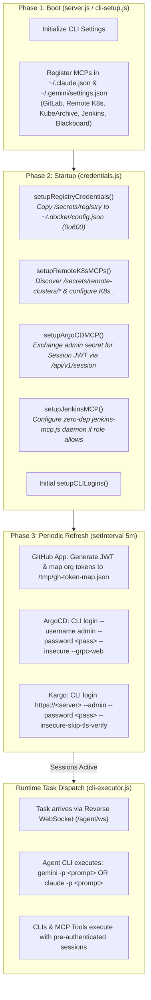

<!-- @ai-rules:
1. [Constraint]: Security-sensitive. Document credential mechanics accurately without exposing secrets.
2. [Pattern]: Mermaid diagrams for credential flow; tables for RBAC permissions.
3. [Pattern]: Distinguish between build-time (Dockerfile) and runtime (K8s Secret) credential access.
4. [Constraint]: No internal hostnames, emails, or credentials. Open-source hygiene.
-->
# Darwin Agent -- External Service Access & MCP Architecture

This document describes how Darwin's central Brain, sidecar agents, and ephemeral Tekton workers authenticate with external infrastructure services, Git providers, CI systems, and remote Kubernetes clusters.

---

## 1. Overview & Security Principles

Darwin enforces strict boundaries between build-time container images and runtime operational credentials:

1. **Zero Baked Credentials**: Container images (`gemini-sidecar`, `darwin-brain`) contain zero tokens, private keys, or API passwords. All credentials are injected at runtime via Kubernetes Secrets mounted into `/secrets/<service>`.
2. **Role-Based Secret Isolation**: Secrets are mounted only into the containers that strictly require them. For example, Developer sidecars receive repository access and Jenkins retest capabilities, but are strictly prohibited from mounting ArgoCD or Kargo promotion secrets.
3. **Decoupled Execution & Non-Interactive Refresh**: Credential bootstrapping and session refresh occur independently of task dispatch. CLI logins (ArgoCD, Kargo) and token maps (GitHub App) are pre-authenticated at container startup and refreshed on background timers to ensure instant, zero-latency agent tool execution.
4. **Hexagonal MCP Architecture**: External services are abstracted through standard Model Context Protocol (MCP) servers or zero-dependency daemon adapters, giving LLMs structured tool interfaces without exposing raw cluster credentials.

---

## 2. Sidecar Credential Lifecycle

Agent sidecars manage external authentication across three distinct lifecycle phases:


```mermaid
flowchart TD
    subgraph Boot ["Phase 1: Boot (server.js / cli-setup.js)"]
        B1["Initialize CLI Settings"]
        B2["Register MCPs in ~/.claude.json & ~/.gemini/settings.json<br/>(GitLab, Remote K8s, KubeArchive, Jenkins, Blackboard)"]
    end

    subgraph Startup ["Phase 2: Startup (credentials.js)"]
        S1["setupRegistryCredentials()<br/><i>Copy /secrets/registry to ~/.docker/config.json (0o600)</i>"]
        S2["setupRemoteK8sMCPs()<br/><i>Discover /secrets/remote-clusters/* & configure K8s_<name></i>"]
        S3["setupArgoCDMCP()<br/><i>Exchange admin secret for Session JWT via /api/v1/session</i>"]
        S4["setupJenkinsMCP()<br/><i>Configure zero-dep jenkins-mcp.js daemon if role allows</i>"]
        S5["Initial setupCLILogins()"]
    end

    subgraph Background ["Phase 3: Periodic Refresh (setInterval 5m)"]
        R1["GitHub App: Generate JWT & map org tokens to /tmp/gh-token-map.json"]
        R2["ArgoCD: CLI login --username admin --password &lt;pass&gt; --insecure --grpc-web"]
        R3["Kargo: CLI login https://&lt;server&gt; --admin --password &lt;pass&gt; --insecure-skip-tls-verify"]
    end

    subgraph Dispatch ["Runtime Task Dispatch (cli-executor.js)"]
        T1["Task arrives via Reverse WebSocket (/agent/ws)"]
        T2["Agent CLI executes: gemini -p &lt;prompt&gt; OR claude -p &lt;prompt&gt;"]
        T3["CLIs & MCP Tools execute with pre-authenticated sessions"]
    end

    Boot --> Startup --> Background
    Background -.->|Sessions Active| Dispatch
```

### Lifecycle Phases
- **Phase 1: Boot**: When the sidecar container boots, `cli-setup.js` initializes the configuration files (`~/.claude.json` and `~/.gemini/settings.json`) registering all available MCP servers for Gemini and Claude Code CLIs.
- **Phase 2: Startup**: `server.js` executes `setupCredentials()` to copy registry credentials, register multi-cluster Kubernetes MCPs, acquire the initial ArgoCD REST Session JWT, and spin up role-gated internal MCP daemons.
- **Phase 3: Periodic Refresh**: A 5-minute background interval (`CLI_LOGIN_INTERVAL_MS = 5 * 60 * 1000`) continuously runs `setupCLILogins()` to renew CLI sessions and JWT maps before tokens expire, preventing task interruption.

---

## 3. The 9 Production Integrations

Darwin natively integrates with 9 external services and tools across source control, GitOps, CI/CD, and cluster runtimes. This section covers sidecar-facing integrations only; it intentionally omits Trusted Proxy and Jira (Brain-only, documented in [deployment.md](deployment.md)'s credentials table), which is why that table's row set differs from this one:

### 3.1 GitHub App (Multi-Org Dynamic Discovery)
- **Purpose**: Authenticates Git operations (`git clone`, `git commit`, `git push`) and GitHub CLI (`gh`) commands across multiple GitHub organizations.
- **Auth Flow**: Uses GitHub App Private Key (`.pem`) and `app-id` to generate App RS256 JWTs. Queries `GET /app/installations` to discover accessible organizations, exchanges tokens per org, and writes `/tmp/gh-token-map.json` (mode `0o600`).
- **Helper Utilities**: Provides `git-credential-darwin` helper and `gh-wrapper.sh` ensuring Git automatically resolves the correct organization token on clone/fetch.
- **Helm Value**: `github.existingSecret`
- **Secret Keys**: `app-id`, optional `installation-id`, and private key file (`*.pem` or `private-key`).
- **Mount Path**: `/secrets/github`
- **Target Containers**: Brain, Architect, SysAdmin, Developer, QE, Ephemeral. (Headhunter runs in-process inside Brain, not as a separate container -- see [agents.md](agents.md).)

### 3.2 GitLab (PAT & Official MCP)
- **Purpose**: MR triage, automated reviews, commenting, and Git repository operations for GitLab-hosted codebases.
- **Auth Flow**: Static Personal Access Token (PAT). Configures `glab mcp serve` (the GitLab CLI's built-in MCP server) in agent CLI settings; the deprecated `@modelcontextprotocol/server-gitlab` package (broken schemas) is no longer used.
- **Helm Value**: `gitlab.existingSecret`
- **Secret Keys**: `token`, `host` (e.g. `gitlab.example.com`).
- **Mount Path**: `/secrets/gitlab`
- **Target Containers**: Brain, Architect, SysAdmin, Developer, QE, Ephemeral. (Headhunter runs in-process inside Brain, not as a separate container -- see [agents.md](agents.md).)

### 3.3 ArgoCD (REST Session JWT & Official MCP)
- **Purpose**: Inspection of ArgoCD Applications, ApplicationSets, sync status, and GitOps rollouts.
- **Auth Flow**: `setupArgoCDMCP()` performs a REST call to `POST /api/v1/session` exchanging admin credentials for an ArgoCD Session JWT. Configures the standalone `argocd-mcp` npm package for agent tool calls. `setupCLILogins()` simultaneously maintains an active `argocd login` CLI session.
- **Helm Value**: `argocd.existingSecret`
- **Secret Keys**: `server`, `auth-token` (admin password).
- **Mount Path**: `/secrets/argocd`
- **Target Containers**: Architect, SysAdmin, Ephemeral (strictly omitted from Developer and QE).

### 3.4 Kargo (CLI Login & Stage CRD Watch)
- **Purpose**: Multi-stage promotion verification, warehouse freight inspection, and automated GitOps promotion execution.
- **Auth Flow**: `setupKargoLogin()` issues `kargo login https://${server} --admin --password ${password} --insecure-skip-tls-verify`. K8s CRD read access is simultaneously provided via cluster RBAC.
- **Helm Value**: `kargo.existingSecret`
- **Secret Keys**: `server`, `auth-token`.
- **Mount Path**: `/secrets/kargo`
- **Target Containers**: Architect, SysAdmin, Ephemeral (strictly omitted from Developer and QE).

### 3.5 Remote Kubernetes Clusters (Multi-Cluster MCP)
- **Purpose**: Read-only observability, pod log inspection, and event streaming across external/target OpenShift and Kubernetes clusters.
- **Auth Flow**: Sidecars scan `/secrets/remote-clusters/<name>/kubeconfig`. For each cluster, `credentials.js` registers a dedicated `kubernetes-mcp-server` instance named `K8s_<name>` with arguments `--read-only --toolsets core,config,tekton`.
- **Helm Value**: `remoteClusters.<name>.existingSecret`
- **Secret Keys**: `kubeconfig` or custom key defined in `values.yaml`.
- **Mount Path**: `/secrets/remote-clusters/<name>`
- **Target Containers**: Architect, SysAdmin, Developer, QE, Ephemeral.

### 3.6 KubeArchive (Zero-Dependency GraphQL/REST MCP)
- **Purpose**: Historical query and audit of archived PipelineRuns and TaskRuns long after pods have been garbage-collected from cluster etcd.
- **Auth Flow**: Registered as `KubeArchive_<name>` pointing to `/app/kubearchive-mcp.js`. Queries remote KubeArchive endpoints via GraphQL and REST using the target cluster's kubeconfig context.
- **Helm Value**: Enabled automatically when `remoteClusters.<name>.kubearchiveUrl` is specified.
- **Mount Path**: Shares `/secrets/remote-clusters/<name>`.
- **Target Containers**: Architect, SysAdmin, Developer, QE, Ephemeral.

### 3.7 Jenkins (Zero-Dependency REST MCP Server)
- **Purpose**: Test job inspection, build status monitoring, and build re-triggering for CI failure remediation.
- **Auth Flow**: Managed via `/app/jenkins-mcp.js`, a zero-external-dependency Node.js MCP server using standard library `node:http`/`node:https` and Basic Auth (`user:token`). Role-gated: only started for `sysadmin`, `developer`, and `ephemeral` agents.
- **Helm Value**: `jenkinsObserver.jenkins.existingSecret`
- **Secret Keys**: `username`, `api-token`. The Jenkins URL is supplied separately via the `JENKINS_URL` env var, not a secret key.
- **Mount Path**: `/secrets/jenkins`
- **Target Containers**: SysAdmin, Developer, Ephemeral (omitted from Architect and QE).

### 3.8 Container Registry Auth (Runtime Docker Config)
- **Purpose**: Authenticated image pulling and inspection using runtime CLI utilities (`skopeo inspect`, `podman pull`).
- **Auth Flow**: `setupRegistryCredentials()` reads `/secrets/registry/.dockerconfigjson` and copies it to `$HOME/.docker/config.json` with permissions `0o600`.
- **Helm Value**: `registry.existingSecret`
- **Secret Type**: `kubernetes.io/dockerconfigjson`
- **Mount Path**: `/secrets/registry`
- **Target Containers**: Brain, Architect, SysAdmin, Developer, QE, Ephemeral.

### 3.9 Internal Blackboard MCPs (Localhost Daemons)
- **Purpose**: In-pod inter-agent communication, collaborative incident huddles, and event logging.
- **Auth Flow**: Zero-credential localhost HTTP daemon MCPs running on port `9090`:
  - `TeamChat`: Shared inter-agent huddle communication.
  - `DarwinBlackboard`: Direct event state inspection and modification.
  - `DarwinJournal`: Structured operational event logging.
- **Helm Value**: Built-in; always active.
- **Target Containers**: All Sidecars and Ephemeral Workers.

---

## 4. Agent Role Credential & Tool Isolation Matrix

| External Service / Tool | Protocol / Type | Brain | Architect | SysAdmin | Developer | QE | Ephemeral (Tekton) |
| :--- | :--- | :---: | :---: | :---: | :---: | :---: | :---: |
| **GitHub App** | Git Helper + Token Map | Yes | Yes | Yes | Yes | Yes | Yes |
| **GitLab PAT** | MCP (`glab mcp serve`) | Yes | Yes | Yes | Yes | Yes | Yes |
| **ArgoCD CLI & MCP** | REST JWT + MCP | No | Yes | Yes | **No** | **No** | Yes |
| **Kargo CLI** | CLI Login (`https://`) | No | Yes | Yes | **No** | **No** | Yes |
| **Remote K8s** | MCP (`kubernetes-mcp`) | No | Yes | Yes | Yes | Yes | Yes |
| **KubeArchive** | MCP (`kubearchive-mcp`) | No | Yes | Yes | Yes | Yes | Yes |
| **Jenkins** | MCP (`jenkins-mcp.js`) | No | **No** | Yes | Yes | **No** | Yes |
| **Container Registry** | `~/.docker/config.json` | Yes | Yes | Yes | Yes | Yes | Yes |
| **Internal MCPs** | Localhost HTTP (9090) | No | Yes | Yes | Yes | Yes | Yes |

---

## 5. In-Chart Kubernetes RBAC (Cluster Reader)

In addition to CLI logins and MCP tools, agents require direct Kubernetes API read access to inspect CRDs and cluster resources without credentials.

All Kubernetes RBAC is packaged inside the Darwin Helm chart (`templates/role.yaml` and `templates/rolebinding.yaml`). The deployment binds the main pod ServiceAccount (`{{ .Release.Name }}-brain`) to the cluster-scoped `{{ .Release.Name }}-cluster-reader` ClusterRole:

```yaml
# Helm: templates/role.yaml
apiVersion: rbac.authorization.k8s.io/v1
kind: ClusterRole
metadata:
  name: {{ .Release.Name }}-cluster-reader
rules:
  # GitOps & Workflow CRDs
  - apiGroups: ["argoproj.io"]
    resources: ["applications", "applicationsets"]
    verbs: ["get", "list", "watch"]
  - apiGroups: ["tekton.dev"]
    resources: ["pipelines", "pipelineruns", "tasks", "taskruns", "pipelineresources"]
    verbs: ["get", "list", "watch"]
  - apiGroups: ["kargo.akuity.io"]
    resources: ["projects", "stages", "promotions", "freight", "warehouses"]
    verbs: ["get", "list", "watch"]

  # Core Cluster Resources
  - apiGroups: [""]
    resources: ["pods", "pods/log", "events", "services", "namespaces", "configmaps"]
    verbs: ["get", "list", "watch"]
  - apiGroups: [""]
    resources: ["pods"]
    verbs: ["delete"] # Restricted remediation verb for stuck/failed pods

  # Workload Workspaces & Metrics
  - apiGroups: ["apps"]
    resources: ["deployments", "replicasets", "statefulsets"]
    verbs: ["get", "list", "watch"]
  - apiGroups: ["metrics.k8s.io"]
    resources: ["pods", "nodes"]
    verbs: ["get", "list"]
```

> [!NOTE]
> `appprojects` is intentionally excluded from the ArgoCD RBAC rules to follow the principle of least privilege. External GitOps ServiceAccounts in `openshift-gitops` or `kargo` namespaces are no longer required.

---

## 6. Verification & Troubleshooting Runbook

To verify agent credentials and MCP tools in a live cluster:

1. **Verify Secret Mounts in Pod**:
   ```bash
   oc exec -it -c sysadmin deploy/darwin-brain -n darwin -- ls -la /secrets/
   ```
2. **Verify GitHub Multi-Org Token Map**:
   ```bash
   oc exec -it -c developer deploy/darwin-brain -n darwin -- cat /tmp/gh-token-map.json
   ```
3. **Verify ArgoCD & Kargo CLI Sessions**:
   ```bash
   oc exec -it -c sysadmin deploy/darwin-brain -n darwin -- argocd app list
   oc exec -it -c sysadmin deploy/darwin-brain -n darwin -- kargo get stages
   ```
4. **Verify MCP Server Configuration**:
   ```bash
   oc exec -it -c architect deploy/darwin-brain -n darwin -- cat ~/.claude.json
   ```
5. **Verify Registry Docker Auth**:
   ```bash
   oc exec -it -c developer deploy/darwin-brain -n darwin -- skopeo inspect docker://registry.example.com/org/app:latest
   ```
