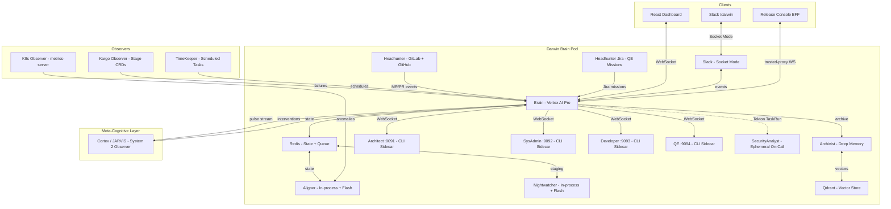

<!-- @ai-rules:
1. [Constraint]: This is the architecture reference. Keep diagrams current with src/main.py lifespan wiring.
2. [Pattern]: Mermaid diagrams must match actual container/process topology (Brain pod = 1 Deployment).
3. [Gotcha]: Reverse WS is the production mode. Legacy mode docs kept for backward compatibility.
4. [Constraint]: No internal hostnames or credentials. Open-source hygiene.
-->
# Architecture

The Brain orchestrates multi-agent conversations via the **Blackboard Pattern** with bidirectional WebSocket communication across Dashboard, Slack, and Release Console.

## System Topology

## Blackboard Pattern

All agents communicate via **shared event documents** in Redis. Agents NEVER communicate directly. The Conversation Queue (`darwin:queue`, `darwin:event:{id}`) is an append-only log of turns with typed actors (brain, user, agent, system).

**Event lifecycle:** `new` → `active` → `waiting_approval` → `resolved` → `closed`

**Event sources:** Aligner (anomaly), Chat (user request), Slack (DM/slash command), Headhunter (GitLab todo, GitHub PR), Headhunter Jira (QE mission), TimeKeeper (scheduled task), Kargo (promotion failure)

## Reversed WebSocket Architecture

In **reverse mode** (`AGENT_WS_MODE=reverse`), sidecars connect **to** the Brain's `/agent/ws` endpoint instead of the Brain connecting out.

| Component | Purpose |
| --- | --- |
| **AgentRegistry** | Dynamic pool of connected agents with busy/idle tracking |
| **TaskBridge** | Per-task `asyncio.Queue` bridging WS handler to dispatch coroutines |
| **Feature flag** | `AGENT_WS_MODE` (`legacy` / `reverse`) |
| **Dashboard** | `GET /api/agents` endpoint for visibility of connected agents |

### WebSocket Message Protocol (Reverse Mode)

| Direction | Type | Fields | When |
| --- | --- | --- | --- |
| Sidecar → Brain | `register` | agent_id, role, capabilities, cli, model | On connect |
| Sidecar → Brain | `progress` | task_id, event_id, message | During execution |
| Sidecar → Brain | `result` | task_id, event_id, output, source, session_id | Task complete |
| Sidecar → Brain | `error` | task_id, event_id, error, retryable | Task failed |
| Sidecar → Brain | `huddle_message` | task_id, event_id, content | Agent-to-Manager communication |
| Sidecar → Brain | `pong` | -- | Heartbeat response |
| Brain → Sidecar | `task` | task_id, event_id, prompt, cwd, autoApprove, session_id | New task |
| Brain → Sidecar | `cancel` | task_id | Cancel running task |
| Brain → Sidecar | `ping` | -- | Heartbeat |

## Slack Integration

Full bidirectional Slack integration via Socket Mode (`src/channels/slack.py`):

- **`/darwin` slash command** -- Creates events from Slack, mirrors Brain conversation to the thread
- **DM notifications** -- Brain calls `notify_user_slack(email, message)` to send targeted DMs
- **Bidirectional threads** -- Recipients can reply in-thread; replies route back to the event conversation
- **Source tagging** -- Every message is tagged with its origin (dashboard, slack) for Brain context
- **Approve/reject via reactions** -- Thumbs up/down on plan messages
- **Thinking indicators** -- Custom emoji shown while the Brain processes, replaced with the final result
- **Thread ownership guard** -- Prevents notification DMs from hijacking existing event threads

## Release Console Integration

Trusted-proxy WebSocket auth for the Release Console BFF. The BFF authenticates via `X-Forwarded-Email` + `X-BFF-Token` headers on the WebSocket upgrade. See [Darwin-Release-Console-Integration-Contract.md](Darwin-Release-Console-Integration-Contract.md) for the full API contract.

| Env Var | Default | Purpose |
| --- | --- | --- |
| `TRUSTED_PROXY_ENABLED` | `"false"` | Must be `"true"` to enable |
| `TRUSTED_PROXY_SECRET` | `""` | Shared secret (inject via K8s Secret) |

## Google Search Grounding

The Brain can query the web during **triage** and **investigate** phases for external context. Useful for verifying upstream outages, checking changelogs, and finding known issues.

Enabled via `BRAIN_GOOGLE_SEARCH_ENABLED=true`. Evidence citations include source URLs when web search confirms an external factor.

**Priority hierarchy:** Deep Memory → Web Search → Agent Investigation. Web search supplements but never replaces operational history or live cluster state.

## L4 Autonomous AI -- Propose and Prompt

The Brain can proactively propose actions to users and prompt for approval, shifting from reactive (wait for request) to proactive (detect → propose → execute on approval). This enables higher autonomy levels while maintaining human oversight on structural changes.

## Waiting for Approval (Approval Pool)

When the Brain calls `request_user_approval`, the event is atomically moved from the active set to the **waiting_approval** pool (`GET /queue/waiting_approval`). These events are excluded from active dispatch and do not consume WIP slots. They sit indefinitely until a human approves or rejects via the dashboard or Slack. The `wait_for_user` tool is restricted to chat/slack events only -- automated events must use `request_user_approval`.

## Cortex / JARVIS (Meta-Cognitive Layer)

Cortex (JARVIS) is a **System 2** observer that watches the Brain's neuron pulse stream without participating in the Conversation Queue directly. It writes turns as `actor="jarvis"` when intervening.

| Mechanism | Purpose |
| --- | --- |
| **Pulse stream** | Every Brain tool call, phase transition, agent dispatch, and memory recall emits a pulse |
| **Friction detection** | SPIRAL (tool fires 5+), PLATEAU (15+ min no phase change), AGENT CHURN (3+ agents), LESSON IGNORED |
| **Intervention** | `send_event_message` — direct conversation turn that wakes the Brain |
| **Shadow mode** | When `SYSTEM2_SHADOW=true`, interventions are logged but not delivered (`GET /api/cortex/shadow`) |
| **Session lifecycle** | On-demand activation; closes after idle timeout; handoff reports on reconnect |

Dashboard routes: `/cortex` (live graph + activity), `/jarvis-memory` (session reports and proposals).

Feature flags (Helm `cortex.*`): `pulseTracking`, `system2.enabled`, `system2.shadow`, `system2.sessionReport`, `system2.handoffReport`.

## Adaptive Message Routing

The `message_agent` tool uses adaptive routing: if the target agent is **idle**, the Brain dispatches directly. If the agent is **busy**, the message goes to the agent's **inbox** (via MCP) for asynchronous pickup. This prevents blocking the Brain's reconcile workers while ensuring no message is lost.

## Safety Model

### Air Gap (Behavioral Enforcement via Agent Rules + Skills)

All sidecars run with `permissionMode: bypassPermissions` at the CLI level. The air gap is enforced **behaviorally** through agent rule files (GEMINI.md) and skills, not through CLI-level technical restrictions. This means the LLM is instructed not to execute certain operations, but no hard technical barrier prevents it.

| Agent | Instructed To Do | Instructed Not To Do |
| --- | --- | --- |
| Architect | Clone + read repos, argocd/kargo read, oc read | Commit, push, kubectl mutations, argocd sync |
| SysAdmin | Git clone/push, kubectl/oc read, argocd sync, kargo read, helm | kubectl write, invent Helm sections |
| Developer | Git clone/push, read Helm, read code | Modify infrastructure, kubectl scale, argocd |
| SecurityAnalyst | Vulnerability scans, SBOM generation, read-only cluster | Commit, push, kubectl mutations, implement fixes |

The `FORBIDDEN_PATTERNS` in `security.py` provides a secondary safety net by blocking known destructive command patterns before they reach the CLI.

### Security Patterns

- `FORBIDDEN_PATTERNS` in `security.py` blocks: `rm -rf`, `drop database`, `kubectl delete namespace`, `git push --force`, etc.
- Dockerfile safety rules: agents can add `ARG/ENV/COPY/RUN` but cannot change `FROM/CMD/USER/WORKDIR`
- Structural changes require user approval (Brain pauses for confirmation)
- Agent concurrency locks prevent WebSocket `recv` conflicts
- ArgoCD/Kargo passwords masked in logs
- AI-generated content tagged in Dashboard (all messages) and Slack (actionable outputs only)

## SDK and Models

The Brain and in-process daemons use `google-genai` Python SDK. Sidecar agents use either Gemini CLI or Claude Code CLI (configurable per agent via `sidecars.<role>.cliType` in Helm values).

| Component | SDK | Default Model |
| --- | --- | --- |
| Brain | `google-genai` Python SDK | `gemini-3.1-pro-preview` |
| Aligner | `google-genai` Python SDK | `gemini-3.5-flash` |
| Archivist | `google-genai` + `AnthropicVertex` | Gemini (digest) + Claude (archive/extraction) |
| Headhunter (GitLab) | `google-genai` Python SDK | `gemini-3.5-flash` |
| Headhunter (GitHub) | `google-genai` Python SDK | `gemini-3.5-flash` |
| Architect sidecar | Claude Code CLI (via Vertex AI) | `claude-opus-4-6` |
| SysAdmin sidecar | Claude Code CLI (via Vertex AI) | `claude-sonnet-4-6` |
| Developer sidecar | Claude Code CLI (via Vertex AI) | `claude-opus-4-6` |
| QE sidecar | Claude Code CLI (via Vertex AI) | `claude-sonnet-4-6` |
| SecurityAnalyst (ephemeral) | Gemini CLI or Claude Code CLI | Inherits sidecar image default |
| Nightwatcher | `google-genai` Python SDK | `gemini-3-flash-preview` |
