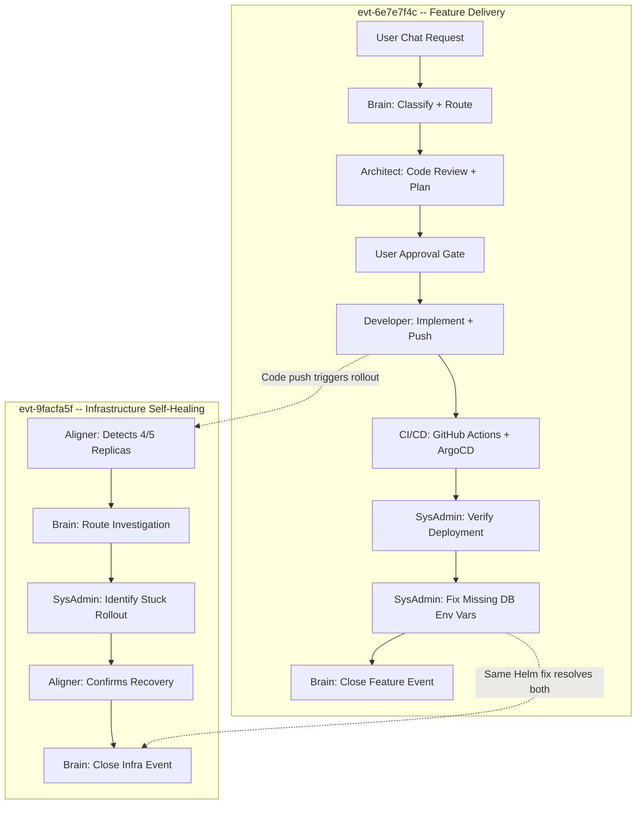

# Autonomous Feature Delivery: Product Images + Infrastructure Self-Healing

> **Event:** `evt-6e7e7f4c` (feature) + `evt-9facfa5f` (infrastructure) | **Duration:** ~25 minutes | **Turns:** 20 + 7 | **Agents:** Brain, Architect, Developer, sysAdmin, Aligner | **Human intervention:** 1 approval + 1 clarification

## Summary

A user requested product image support for the `darwin-store` app via chat. The Brain orchestrated a full feature delivery lifecycle: Architect planned, user approved, Developer implemented and pushed code, sysAdmin verified the deployment. During the rollout, the Aligner independently detected a stuck deployment (4/5 replicas) caused by missing database environment variables. The sysAdmin investigated the infrastructure event, identified the root cause, fixed the Helm deployment template, and both events resolved.

This demonstrates two concurrent autonomous workflows: **feature delivery** and **infrastructure self-healing** -- running simultaneously on the same service.

## Feature Delivery Flow (evt-6e7e7f4c)

### Phase 1: Planning (Turns 1-5)

**User** requests product images via chat:

> *"in the darwin-store app i need to add product images to the 'Add Product' and an image preview in the 'Product Inventory'"*

**Brain** looks up service metadata (v55, 5 replicas, PostgreSQL dependency), classifies as Complex (new feature), routes to Architect:

> **Brain** (21:57): *Routing to Architect -- Review the darwin-store codebase and create a plan to implement product images. Consider database implications (postgres dependency) for storing images or image references.*

**Architect** clones the repo, reads the full codebase (`models.py`, `routes/products.py`, `static/index.html`, `helm/values.yaml`, `requirements.txt`, `deployment.yaml`), and produces a structured plan saved to `./results/findings.md`:

> **Architect**: Plan covers Frontend (file input, Base64 conversion, thumbnails), Backend (model update, PostgreSQL persistence), Database (schema migration, image storage strategy), with risk assessment and rollback plan.

### Phase 2: User Approval (Turns 5-13)

**Brain** presents the plan summary and requests approval:

> **Brain** (22:00): *Frontend: Add file input + thumbnails. Backend: Switch from in-memory to PostgreSQL + add image_data field. Database: Store images as Base64 text. Risk: Medium (DB bloat mitigated by size limits). Do you approve?*

**User** couldn't see the full plan (it was in a file), asked the Brain to retrieve it:

> **User**: *"I can't see the plan, can you access the file?"*

**Brain** routed Architect to read and output `./results/findings.md`, then re-presented the full plan with all 5 implementation steps and risk assessment. **User approved.**

### Phase 3: Implementation (Turns 14-15)

**Brain** routes to Developer with detailed task instructions covering all 4 layers (frontend, models, backend/persistence, dependencies):

> **Brain** (22:13): *Routing to Developer -- Implement the approved plan. Crucial: Replace the in-memory _products list with actual PostgreSQL calls. Use the environment variables from the Helm chart for DB connection.*

**Developer** implements all changes across `index.html`, `models.py`, `routes/products.py`, `main.py`, pushes to repo.

### Phase 4: Deployment Verification (Turns 16-18)

**Brain** defers for 120s to wait for CI/CD, then routes sysAdmin to verify:

> **Brain** (22:15): *Check the status and age of the darwin-store pods. Have they restarted recently? Check the logs to verify the application successfully connected to PostgreSQL and created the products table.*

**sysAdmin** discovers pods are crash-looping -- the new code requires `DB_HOST`, `DB_PORT`, `DB_USER`, `DB_PASSWORD`, `DB_NAME` environment variables that aren't in the Helm deployment template.

**sysAdmin** autonomously:
1. Identified the missing env vars by reading the application code
2. Updated `helm/templates/deployment.yaml` to inject the database configuration
3. Committed and pushed the fix
4. Waited for ArgoCD sync
5. Verified all 5 pods running with successful database connection and schema initialization

### Phase 5: Closure (Turn 19)

> **Brain** (22:23): *Implemented product image upload and preview features. SysAdmin identified missing DB env vars and updated the Helm deployment template. All 5 pods running and healthy.*

---

## Concurrent Infrastructure Self-Healing (evt-9facfa5f)

While the feature was being deployed, the Aligner independently detected a problem:

### Detection

> **Aligner** (22:10): *darwin-store has 4/5 replicas. Anomaly: warning_complicated.*

The rolling update from the Developer's code push created new pods that couldn't start (missing DB env vars), leaving the deployment stuck at 4/5 ready replicas.

### Investigation

**Brain** routes sysAdmin to investigate the replica mismatch:

> **sysAdmin** (22:12): *A rolling update is in progress but new pods are failing to reach ready state. The previous ReplicaSet (Revision 108) had connection refused errors during health probes because the application failed to start its web server due to missing database configuration.*

The Aligner provides additional context:

> **Aligner** (22:13): *I observed a recurring pattern of 100% error rates at 22:10:50 and 22:11:25, accompanied by CPU spikes to 62.5%, followed by periods of zero activity.*

### Resolution

The sysAdmin's fix from the feature event (adding DB env vars to deployment.yaml) resolved both events simultaneously. Revision 109 deployed successfully.

> **Brain** (22:23): *Resolved. Revision 108 lacked database configuration. Revision 109 corrected it. All 5 pods running and healthy.*

---

## Key Observations

### Full Feature Delivery Lifecycle

The Brain orchestrated all phases of a feature request:

```text
User Request -> Architect Plans -> User Approves -> Developer Implements
    -> CI/CD Builds -> SysAdmin Verifies -> SysAdmin Fixes Infra Gap -> Done
```

This is the first end-to-end feature delivery completed autonomously (with one human approval gate).

### Infrastructure Self-Healing During Deployment

Two parallel event streams ran simultaneously:
- **evt-6e7e7f4c** (feature): Brain coordinating the feature implementation
- **evt-9facfa5f** (infra): Brain investigating why the deployment was stuck

The sysAdmin's fix (adding DB env vars) resolved both events. The Brain correctly correlated the infrastructure issue with the ongoing deployment.

### Architect-Developer-SysAdmin Pipeline

Each agent stayed in its lane:
- **Architect**: Analyzed code, produced plan with risk assessment. Never executed.
- **Developer**: Implemented code changes, pushed to repo. Never investigated infra.
- **SysAdmin**: Verified deployment, identified missing config, fixed Helm template. Never modified application code.

### Adaptive Problem Solving

When the Developer's code required environment variables that weren't in the deployment:
1. The sysAdmin didn't just report the error -- it read the application source code to understand what was needed
2. Identified the specific env vars (`DB_HOST`, `DB_PORT`, `DB_USER`, `DB_PASSWORD`, `DB_NAME`)
3. Updated the Helm template to inject them from the existing ConfigMap
4. Verified the fix end-to-end

### User Interaction

Only two human touchpoints in the entire flow:
1. **Approval**: User approved the implementation plan (required for structural code changes)
2. **Clarification**: User couldn't see the plan file, Brain retrieved and re-presented it

### Ops Journal Context

The Brain's temporal memory (ops journal) showed the event history:

```text
[22:21] Feature implementation -- closed in 18 turns
[22:23] Rolling update stuck (4/5 replicas) -- closed in 6 turns
```

---

## Timeline

| Time  | Actor     | Action                                                                                          |
|-------|-----------|------------------------------------------------------------------------------------------------|
| 21:57 | User      | Requests product image feature via chat                                                        |
| 21:57 | Brain     | Looks up service metadata, routes to Architect                                                 |
| 21:59 | Architect | Clones repo, analyzes codebase, produces implementation plan                                   |
| 22:00 | Brain     | Presents plan summary, requests user approval                                                  |
| 22:03 | User      | Can't see plan file, asks Brain to retrieve it                                                 |
| 22:05 | Architect | Reads findings.md, outputs full plan                                                           |
| 22:06 | Brain     | Re-presents full plan with all steps and risks                                                 |
| 22:08 | User      | Approves the plan                                                                              |
| 22:08 | Brain     | Routes to Developer with detailed implementation tasks                                         |
| 22:10 | Developer | Implements all changes, pushes to repo                                                         |
| 22:10 | Aligner   | Detects 4/5 replicas (concurrent infra event created)                                          |
| 22:10 | Brain     | Routes sysAdmin to investigate replica mismatch (infra event)                                  |
| 22:12 | sysAdmin  | Identifies stuck rolling update, missing DB env vars (infra event)                             |
| 22:12 | Brain     | Defers feature event 120s for CI/CD                                                            |
| 22:15 | Brain     | Routes sysAdmin to verify deployment (feature event)                                           |
| 22:17 | sysAdmin  | Finds crash-looping pods, identifies missing env vars, updates Helm template, pushes fix       |
| 22:19 | sysAdmin  | Verifies all 5 pods running, DB connection successful, schema initialized                      |
| 22:21 | Brain     | Closes feature event -- implementation complete + infra fixed                                  |
| 22:23 | Brain     | Closes infra event -- rolling update resolved by Revision 109                                  |
| 22:23 | User      | Tests feature, notes 100KB image limit is restrictive                                          |

## Architecture


