# Iterative Planning: User-in-the-Loop GitOps Scaling

> **Event:** `evt-850437c1` | **Duration:** ~24 minutes | **Turns:** 31 | **Agents:** Brain, Architect, sysAdmin, Aligner | **Human intervention:** 1 rejection + 1 message + 1 approval (implicit via scaling)

## Summary

The Aligner detected that `darwin-store` was over-provisioned (5 replicas at 2% CPU). The Brain coordinated a multi-agent investigation and produced three successive plans -- each revised based on user feedback about GitOps constraints. The user educated the system about ArgoCD replica drift, causing the Brain to progressively simplify the solution from HPA to static scaling.

This demonstrates the **Complex domain probe-sense-respond** pattern: the system proposed, the user corrected, the system adapted -- three times -- until the simplest valid solution emerged.

## The Three Plans

### Plan 1: Standard HPA (Rejected)

**Architect** proposed adding a `HorizontalPodAutoscaler` with min 2 / max 5 replicas:

> **Architect**: Create `helm/templates/hpa.yaml`, add autoscaling section to `values.yaml`, set `targetCPUUtilizationPercentage: 80`.

**User rejected**: *"the application is deployed with argocd, hpa will cause issues"*

The Brain correctly identified the user's concern and routed back to Architect with the constraint.

### Plan 2: ArgoCD-Compatible HPA (Rejected)

**Architect** revised to conditionally omit the `replicas` field when HPA is active:

> **Architect**: Add `{{- if not .Values.autoscaling.enabled }}` guard around `replicas:` in `deployment.yaml`. When HPA manages scaling, ArgoCD won't see drift on the replica count.

**User rejected again**: *"this is not the solution for auto-scaling with gitops, argoCD is maintaining the state from git, adding hpa will cause drift from the committed replicas vs the hpa replica"*

The user explained that the fundamental issue is ArgoCD's reconciliation model -- it treats the Git-committed state as the source of truth. Any runtime mutation (including HPA) creates drift.

### Plan 3: Static Scaling (Approved + Executed)

**Architect** produced the simplest possible plan:

> **Architect**: Change `replicaCount` from 5 to 2 in `helm/values.yaml`. No HPA, no templates, no annotations. Risk: Low.

The Brain routed sysAdmin to execute. After ArgoCD synced (3 verification cycles over ~90s), replicas confirmed at 2/2.

## Conversation Flow

```mermaid
graph TD
    subgraph investigation [Phase 1: Investigation]
        Aligner[Aligner: Over-provisioned 5 replicas] --> Brain1[Brain: Route sysAdmin]
        Brain1 --> SysAdmin1[sysAdmin: Confirms no HPA, 2% CPU]
    end

    subgraph plan1 [Phase 2: Plan 1 -- HPA]
        SysAdmin1 --> Brain2[Brain: Route Architect]
        Brain2 --> Architect1[Architect: HPA Plan]
        Architect1 --> Approval1[Brain: Request Approval]
        Approval1 --> Reject1[User: HPA causes ArgoCD issues]
    end

    subgraph plan2 [Phase 3: Plan 2 -- ArgoCD-Compatible HPA]
        Reject1 --> Brain3[Brain: Route Architect with constraint]
        Brain3 --> Architect2[Architect: Conditional replicas field]
        Architect2 --> Approval2[Brain: Request Approval]
        Approval2 --> Reject2[User: Still causes GitOps drift]
    end

    subgraph plan3 [Phase 4: Plan 3 -- Static Scaling]
        Reject2 --> Brain4[Brain: Route Architect with full context]
        Brain4 --> Architect3[Architect: Just change replicaCount to 2]
        Architect3 --> Brain5[Brain: Route sysAdmin to execute]
        Brain5 --> SysAdmin2[sysAdmin: Push replicaCount=2]
    end

    subgraph verify [Phase 5: Verification]
        SysAdmin2 --> Verify1[Aligner: Still 5/5 -- ArgoCD syncing]
        Verify1 --> Defer[Brain: Defer 45s + 120s]
        Defer --> Verify2[Aligner: 2/2 -- Confirmed]
        Verify2 --> Close[Brain: Close event]
    end
```

## Key Observations

### User as Domain Expert

The Brain and Architect didn't understand the ArgoCD replica drift problem initially. The user's two rejections with explanations taught the system:

1. First rejection: "HPA will cause issues with ArgoCD" -- vague signal
2. Second rejection: "ArgoCD maintains state from git, HPA causes drift from committed replicas vs HPA replica" -- precise technical explanation

The Brain passed each rejection's content directly to the Architect, who revised accordingly.

### Progressive Simplification (KISS)

Each plan was simpler than the last:

| Plan                   | Complexity | Files Changed         | New Templates                          |
|------------------------|------------|-----------------------|----------------------------------------|
| Plan 1: HPA            | High       | 2 modified + 1 new    | hpa.yaml                               |
| Plan 2: ArgoCD HPA     | Higher     | 3 modified + 1 new    | hpa.yaml + deployment.yaml conditional |
| Plan 3: Static scaling | Minimal    | 1 value changed       | None                                   |

The simplest solution was the correct one. The system needed the user's domain knowledge to reach it.

### Patient Verification

After the sysAdmin pushed the change, the Brain verified three times:

- Turn 24: Replicas 5/5 -- ArgoCD hasn't synced yet
- Turn 27: Replicas 5/5 -- still syncing
- Turn 30: Replicas 2/2 -- confirmed

The Brain deferred between checks (45s, 120s) to give ArgoCD time to reconcile, rather than closing prematurely or panic-escalating.

### Brain Adapted the Routing Target

- Plans 1-2: Brain routed to **Architect** with incrementally refined constraints
- Plan 3: Brain routed to **sysAdmin** for direct execution (no further planning needed)

The Brain recognized when planning was exhausted and shifted to execution mode.

### Known Bug: Defer-While-Waiting

Turns 8-9 and 15-16 show the Brain calling `defer_event` after `request_user_approval` -- the same bug documented in the three bug fixes plan. The fix (adding `_waiting_for_user` guard to `request_user_approval`) has been coded but not yet deployed to the cluster at the time of this event.

## Cynefin Classification

This event started as **Clear** (over-provisioned -> scale down) but became **Complex** when the user introduced constraints the system didn't know about (ArgoCD drift). The probe-sense-respond pattern emerged naturally:

- **Probe 1**: HPA proposal -> User says "ArgoCD issues"
- **Probe 2**: Conditional replicas -> User says "still drift"
- **Probe 3**: Static scaling -> User accepts (implicitly, via execution)

The solution emerged from the feedback loop, not from upfront analysis.

## Timeline

| Time  | Actor     | Action                                                                              |
|-------|-----------|-------------------------------------------------------------------------------------|
| 23:21 | Aligner   | Detects over-provisioning (5 replicas, 2% CPU)                                      |
| 23:22 | Brain     | Routes sysAdmin to investigate                                                      |
| 23:23 | sysAdmin  | Confirms: no HPA, static 5 replicas, 2% CPU utilization                             |
| 23:24 | Brain     | Routes Architect to plan HPA                                                        |
| 23:25 | Architect | Produces Plan 1: standard HPA (min 2, max 5)                                        |
| 23:26 | Brain     | Requests user approval for HPA                                                      |
| 23:28 | User      | *"HPA will cause issues with ArgoCD"*                                               |
| 23:29 | Brain     | Routes Architect with ArgoCD constraint                                             |
| 23:30 | Architect | Produces Plan 2: conditional replicas field                                         |
| 23:31 | Brain     | Requests user approval for revised plan                                             |
| 23:33 | User      | Rejects: *"ArgoCD maintains state from git, HPA causes drift"*                      |
| 23:34 | Brain     | Routes Architect with full GitOps context                                           |
| 23:35 | Architect | Produces Plan 3: static scaling (replicaCount: 5 -> 2)                              |
| 23:36 | Brain     | Routes sysAdmin to execute                                                          |
| 23:37 | sysAdmin  | Pushes replicaCount=2 to repo                                                       |
| 23:38 | Brain     | Verifies via Aligner: 5/5 (syncing)                                                 |
| 23:40 | Brain     | Defers, re-verifies: 5/5 (still syncing)                                            |
| 23:43 | Brain     | Re-verifies: 2/2 -- confirmed                                                       |
| 23:45 | Brain     | **Event closed** -- scaled down via static GitOps change                            |
