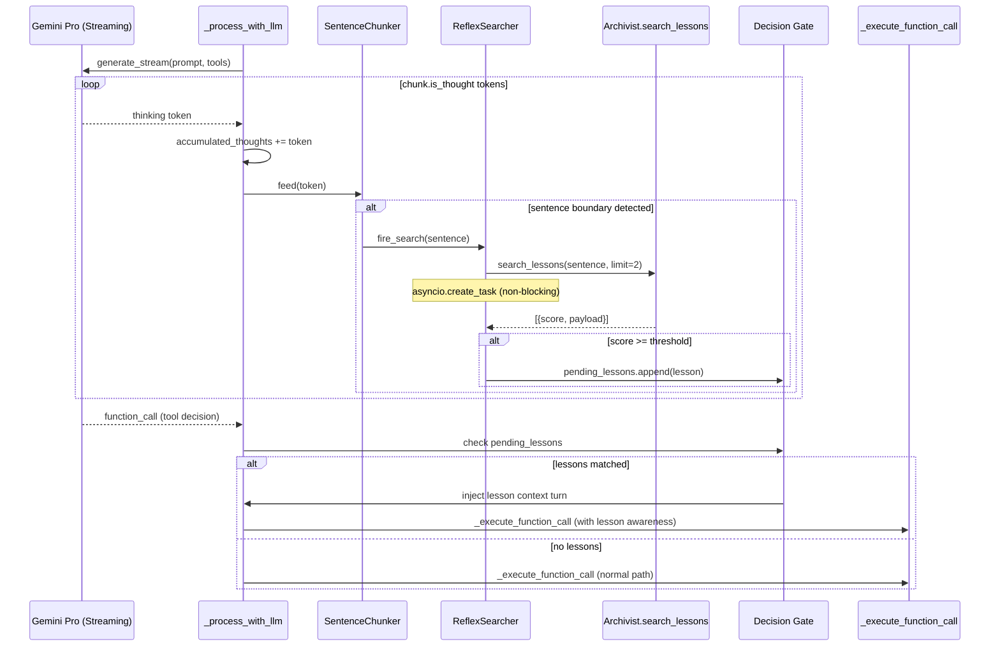
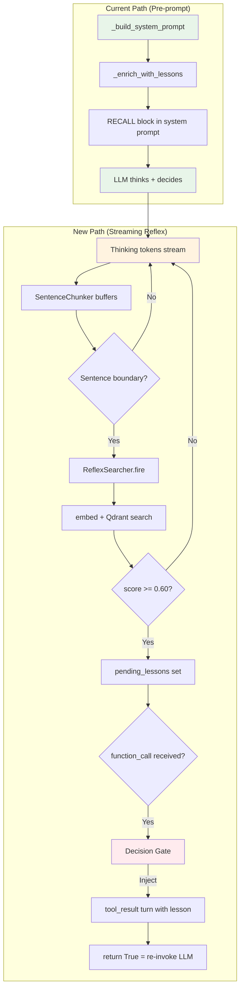

# Memory Reflex: Real-Time Lesson Search During LLM Thinking

## 1. Architecture Diagram





---

## 2. Evidence Summary

### 2.1 Affected Files

| File | Evidence | `@ai-shebang` Constraints |
|---|---|---|
| `brain.py` L1199-1211 | `chunk.is_thought` handling — token accumulation loop. Injection point for chunker. | Rule #31: `_reasoning_by_event` lifecycle. Rule #13: `brain_thinking` WS messages bracket streaming. |
| `brain.py` L1290-1296 | `_execute_function_call` call site — between reasoning storage and execution. Gate injection point. | Rule #28: No local datetime imports inside `_execute_function_call`. |
| `brain.py` L1797-1863 | `_enrich_with_lessons()` — existing pre-prompt enrichment. Must continue working (belt+suspenders). | Rule #29: Gated by `BRAIN_LESSON_ENRICHMENT` env var. 10s timeout. |
| `brain.py` L418-435 | Instance state initialization — new state dicts go here. | Rule #2: per-event asyncio.Lock prevents concurrent calls. |
| `brain.py` L864-879 | Iteration loop — `max_llm_iterations = 5`. Gate rejections consume iterations. | Bounded loop prevents runaways. |
| `archivist.py` L483-519 | `search_lessons()` — embed + Qdrant search. ~200ms latency (embed ~100ms + Qdrant ~100ms). | Rule #8: uuid4 IDs, channel weighting (0.6x experience). Rule #11: pulse_port emits on search. |
| `vector_store.py` L87-112 | `VectorStore.search()` — Qdrant REST POST. 30s httpx timeout. | Rule #1: httpx only, no qdrant-client. Rule #4: 768-dim vectors. |

### 2.2 Dependencies

| Dependency | Used By | Notes |
|---|---|---|
| `google-genai` (embed_content) | Archivist — `_client.aio.models.embed_content()` | Shared quota with Archivist searches. text-embedding-005, 768-dim. |
| `httpx` (async) | VectorStore — Qdrant REST API | 30s default timeout; reflex searches should use tighter timeout. |
| `asyncio` | Brain — task management | `create_task` for non-blocking searches. `asyncio.Lock` per event. |

### 2.3 Transitive Consumers

| Consumer | Impact |
|---|---|
| JARVIS (PulsePort) | `_reasoning_by_event` is consumed by `_emit_executive_pulse`. Reflex searches add new pulse data. No breaking change. |
| Dashboard WS | `brain_thinking` broadcasts unchanged. New `brain_reflex_hit` broadcast type for UI (optional). |
| `_process_intermediate` | Clears `_reasoning_by_event` on entry. Reflex state must also be cleared. |
| `_close_and_broadcast` | Clears `_reasoning_by_event`. Reflex state must also be cleared. |

### 2.4 Existing Patterns

- **Error handling**: All Archivist methods wrap in try/except, log warning, return empty. Reflex must follow.
- **Logging**: Structured via `logger.info/debug/warning`. Pattern: `f"Brain reflex: {detail} for {event_id}"`.
- **Feature flags**: `BRAIN_LESSON_ENRICHMENT` env var gates pre-prompt enrichment. New flag: `BRAIN_MEMORY_REFLEX`.
- **Naming**: `_reasoning_by_event`, `_waiting_for_user`, `_active_agent_for_event` — underscore-prefixed dicts keyed by event_id.

---

## 3. Design Decisions

### 3.1 Question 1: Decision Gate vs Advisory Injection

**Decision: Decision Gate (reject and retry)**

Rationale:
- Advisory injection (appending lessons to the next iteration's context) means the LLM has already committed to a tool call. The lesson arrives one iteration too late — the exact problem we're solving.
- The gate pattern intercepts BETWEEN `_reasoning_by_event[event_id] = accumulated_thoughts` (L1291) and `_execute_function_call` (L1292). If pending lessons exist, we write a `tool_result` turn with the lesson text and `return True` to re-invoke the LLM with the lesson visible in its context.
- This consumes one iteration from `max_llm_iterations` (currently 5). Acceptable: reflex hits are rare (1-2 per cycle max), leaving 3-4 iterations for normal operation.
- **Safeguard**: If iteration >= 4 (last iteration), skip the gate — execute the tool call regardless. Never block the final iteration.

### 3.2 Question 2: Async Gap / Race Condition

**Design: Collect-then-gate, not block-on-search**

The thinking stream might finish before all async searches complete. Solution:

1. Searches fire via `asyncio.create_task` as sentences complete.
2. After the stream ends (function_call received), we `await asyncio.gather(*pending_search_tasks, return_exceptions=True)` with a **500ms timeout**.
3. Any searches that complete within the timeout contribute to the gate. Late arrivals are discarded (logged).
4. The 500ms timeout is a budget that runs AFTER the stream ends — it doesn't delay the stream itself.

This is safe because:
- The stream already takes 2-10s of thinking. Searches launched during early sentences will be done by stream end.
- Only the last 1-2 sentences might have in-flight searches when the stream ends.
- 500ms post-stream wait is within acceptable latency budget.

### 3.3 Question 3: Per-Sentence vs Sliding Window

**Decision: 2-sentence sliding window**

Rationale:
- Single sentences from thinking tokens are often fragments ("I should check the pipeline...") — too short for quality semantic search.
- 2-sentence windows provide better semantic coherence without excessive context.
- Implementation: buffer accumulates sentences. On every new sentence boundary, search on `sentences[-2:]` joined.
- First sentence fires alone (no window yet). Subsequent sentences fire as 2-sentence windows.

### 3.4 Question 4: Iteration Budget

**Decision: Gate rejections DO consume iterations, with safeguards**

- Max 1 gate rejection per `_process_with_llm` call. After the first gate fires, disable reflex for that call.
- Last iteration (iteration 4 of 5) skips the gate entirely.
- Net effect: worst case, 1 of 5 iterations is a lesson-guided retry. Acceptable.

---

## 4. Implementation Strategy

### 4.1 Pattern Selection: Observer + Gate

This follows the existing codebase pattern of in-stream observation (like grounding metadata capture at L1216-1217) combined with post-stream gating (like hallucinated tool rejection at L1274-1289). The reflex adds a parallel observer (sentence chunker) and a new gate before `_execute_function_call`.

### 4.2 Component Decomposition

Two new internal classes, both in a new file `brain_reflex.py`:

1. **`SentenceChunker`** — Stateful buffer that accumulates thinking tokens and yields 2-sentence windows on boundary detection.
2. **`ReflexSearcher`** — Fires async searches, deduplicates lessons, enforces per-cycle caps.

Brain's `_process_with_llm` gains ~20 lines: chunker feed in the stream loop, gate check after the stream.

### 4.3 Breaking Changes

**None.** The existing `_enrich_with_lessons()` pre-prompt path is unchanged. The reflex is additive, gated by a separate feature flag (`BRAIN_MEMORY_REFLEX`), and defaults to disabled.

---

## 5. Atomic Execution Steps

### Step 1: `SentenceChunker` class

**Cynefin: Clear** — well-defined string splitting algorithm.

**File**: `BlackBoard/src/agents/brain_reflex.py` (new file)

**Specification**:
- `__init__(self, min_length: int = 40)` — minimum character length before a boundary triggers a window.
- `feed(self, token: str) -> str | None` — accepts a thinking token, returns a 2-sentence window string when a boundary is detected, else `None`.
- Boundary detection: split on `. ` followed by uppercase letter, or `\n` followed by non-whitespace. Simple heuristic per constraints.
- Internal state: `_buffer: str`, `_sentences: list[str]`.
- `reset(self)` — clears state for reuse.

**Evidence**: Thinking tokens at L1201-1202 are raw strings appended to `accumulated_thoughts`. The chunker wraps the same append with boundary detection.

**Verification**: Unit test with 3 cases:
1. Short tokens that don't trigger boundary → returns None.
2. Token containing `. ` boundary → returns 2-sentence window.
3. Multiple rapid boundaries → returns windows in order.

---

### Step 2: `ReflexSearcher` class

**Cynefin: Complicated** — async task management with dedup and caps.

**File**: `BlackBoard/src/agents/brain_reflex.py`

**Specification**:
- `__init__(self, archivist, event_id: str, score_threshold: float = 0.60, max_searches: int = 5)`
- `fire(self, query: str) -> None` — creates an `asyncio.Task` that calls `archivist.search_lessons(query, limit=2)`. Increments search counter. No-op if counter >= `max_searches`.
- `async gather(self, timeout: float = 0.5) -> list[dict]` — awaits all pending tasks with timeout. Returns deduplicated lessons above threshold. Logs discarded late arrivals.
- Dedup: by lesson payload title (set of seen titles). Same lesson from different sentence windows fires once.
- `_pending_tasks: list[asyncio.Task]`
- `_seen_titles: set[str]`
- `_search_count: int`
- `matched_lessons: list[dict]` — populated by `gather()`.

**Evidence**: `archivist.search_lessons()` (L483-519) is the existing async method. It handles its own error logging. ReflexSearcher wraps it with task management.

**`@ai-shebang` for new file**:
```python
# @ai-rules:
# 1. [Constraint]: Non-blocking. All searches via asyncio.create_task. Never await in feed().
# 2. [Pattern]: Dedup by lesson title. Same lesson from different windows fires once.
# 3. [Gotcha]: gather() timeout must be generous enough for late searches but not block the LLM loop.
# 4. [Constraint]: max_searches cap prevents flooding the embedding API during verbose thinking.
# 5. [Pattern]: All errors caught and logged as warnings. Failure = empty results, never crash.
```

**Verification**: Unit test with 3 cases:
1. Fire 3 searches, gather → returns deduplicated lessons.
2. Fire 6 searches (over cap) → only 5 execute.
3. Slow search exceeds timeout → discarded, logged.

---

### Step 3: Wire `SentenceChunker` into the streaming loop

**Cynefin: Complicated** — integration into existing stream loop without breaking broadcast or accumulation.

**File**: `BlackBoard/src/agents/brain.py`, `_process_with_llm` method.

**Changes**:
1. Import `SentenceChunker`, `ReflexSearcher` from `brain_reflex`.
2. After L1186 (`accumulated_thoughts = ""`), instantiate:
   ```python
   reflex_chunker = None
   reflex_searcher = None
   if self._memory_reflex_enabled:
       from .brain_reflex import SentenceChunker, ReflexSearcher
       archivist = self.agents.get("_archivist_memory")
       if archivist and hasattr(archivist, "search_lessons"):
           reflex_chunker = SentenceChunker()
           reflex_searcher = ReflexSearcher(archivist, event_id)
   ```
3. Inside `if chunk.is_thought:` block (L1201-1202), after `accumulated_thoughts += chunk.text`, add:
   ```python
   if reflex_chunker:
       window = reflex_chunker.feed(chunk.text)
       if window and reflex_searcher:
           reflex_searcher.fire(window)
   ```

**Evidence**: L1199-1211 is the streaming loop. `chunk.text` is the raw token. The broadcast at L1205-1211 is unaffected — chunker runs after accumulation, before broadcast.

**Verification**: Deploy with `BRAIN_MEMORY_REFLEX=false` (default) — zero behavior change. Enable flag, verify searches fire in logs during thinking.

---

### Step 4: Add the Decision Gate before `_execute_function_call`

**Cynefin: Complicated** — the core control flow change. Must not break the iteration loop or existing tool execution.

**File**: `BlackBoard/src/agents/brain.py`, `_process_with_llm` method.

**Changes at L1290-1296** (between `logger.info` and `return await self._execute_function_call`):

```python
# Memory reflex gate: check for lesson matches before executing tool
if reflex_searcher and iteration < (max_retries):  # Never gate the last retry
    lessons = await reflex_searcher.gather(timeout=0.5)
    if lessons:
        lesson_text = "\n".join(
            f"- **{l['payload'].get('title', 'Pattern')}**: {l['payload'].get('pattern', '')}"
            for l in lessons
        )
        gate_turn = ConversationTurn(
            turn=(await self._next_turn_number(event_id)),
            actor="system",
            action="reflex",
            thoughts=(
                f"MEMORY REFLEX: Your reasoning triggered {len(lessons)} lesson match(es) "
                f"from past events. Review before proceeding with `{function_call.name}`:\n\n"
                f"{lesson_text}\n\n"
                f"Reconsider your decision in light of these patterns."
            ),
            response_parts=captured_parts,
        )
        await self._append_and_broadcast(event_id, gate_turn)
        await self._broadcast({
            "type": "brain_reflex_hit",
            "event_id": event_id,
            "lessons": [l["payload"].get("title", "") for l in lessons],
            "blocked_tool": function_call.name,
        })
        logger.info(
            f"Brain reflex: gate fired for {event_id}, "
            f"blocked {function_call.name}, "
            f"{len(lessons)} lessons injected"
        )
        # Disable reflex for remainder of this _process_with_llm call
        reflex_searcher = None
        reflex_chunker = None
        return True  # Re-invoke LLM with lesson context visible
```

**Evidence**:
- L1274-1289 already has a pattern for rejecting and retrying (hallucinated tool names). Same structure: write a turn, return True.
- `return True` makes the iteration loop at L865-876 re-invoke `_process_with_llm` with iteration+1. The event is re-fetched at L867-868, picking up the reflex turn.
- `max_retries` at L1172 is 3 (retry count for transient errors). The iteration guard uses `iteration` from the outer loop (L924). **Correction**: the gate should check against `max_llm_iterations - 1` from the outer loop. Since the inner method doesn't know the outer iteration count, pass `iteration` as a parameter (already present at L924).

**Safeguard**: `iteration < 4` (hardcoded as `max_llm_iterations - 1 = 4`). On the last iteration, the gate is skipped. This is already passed in as a parameter to `_process_with_llm`.

**Verification**:
1. Create a lesson "Never close slack events without replying first".
2. Trigger a slack event. Brain thinks "I'll close this event now" → reflex fires → gate blocks `close_event` → LLM re-invokes with lesson context → LLM decides to `notify_user_slack` first.
3. Verify iteration count: expect 2 iterations (original + retry), not a runaway loop.

---

### Step 5: Instance state initialization + cleanup

**Cynefin: Clear** — standard dict initialization following existing pattern.

**File**: `BlackBoard/src/agents/brain.py`

**Changes**:
1. At L435 (after `_lesson_enrichment_enabled`), add:
   ```python
   self._memory_reflex_enabled = os.getenv("BRAIN_MEMORY_REFLEX", "false").lower() == "true"
   ```

2. In `_close_and_broadcast` (where `_reasoning_by_event` is cleaned at L5071): no new state to clean — `SentenceChunker` and `ReflexSearcher` are local to `_process_with_llm` (stack-scoped, GC'd on return).

3. In `_process_intermediate` (L1340): no cleanup needed — reflex is only active during `_process_with_llm`, which is not re-entrant for the same event (per-event Lock at Rule #2).

**Evidence**: L435 — `self._lesson_enrichment_enabled` is the pattern for feature flags. L5069-5073 — cleanup cascade pattern.

**Verification**: Grep for `_memory_reflex_enabled` — should appear in `__init__` and `_process_with_llm` only.

---

### Step 6: Helm values + environment variable

**Cynefin: Clear** — standard env var addition.

**File**: `BlackBoard/helm/values.yaml` and ArgoCD overlay `darwin-blackboard.yaml`.

**Changes**:
1. Add `BRAIN_MEMORY_REFLEX: "false"` to values.yaml `env` section (disabled by default).
2. Add configurable threshold: `BRAIN_REFLEX_THRESHOLD: "0.60"`.
3. Add configurable max searches: `BRAIN_REFLEX_MAX_SEARCHES: "5"`.

**Evidence**: L435 — `BRAIN_LESSON_ENRICHMENT` is the existing pattern for lesson feature flags in Helm values.

**Verification**: `helm template` succeeds with new values.

---

### Step 7: Dashboard WS broadcast (optional, non-blocking)

**Cynefin: Clear** — additive broadcast type.

**File**: `BlackBoard/src/agents/brain.py` (already done in Step 4's broadcast call).

The `brain_reflex_hit` message type is broadcast in Step 4. The BlackBoard dashboard frontend can optionally render it. This step is about documenting the WS contract:

```json
{
  "type": "brain_reflex_hit",
  "event_id": "evt-xxx",
  "lessons": ["Never close without replying"],
  "blocked_tool": "close_event"
}
```

**Verification**: Open dashboard WS, trigger reflex, observe message in devtools Network tab.

---

### Step 8: Update `@ai-shebang` in `brain.py`

**Cynefin: Clear** — documentation update.

**File**: `BlackBoard/src/agents/brain.py`

Add new rules to the shebang block:
```python
# 35. [Pattern]: Memory reflex: SentenceChunker + ReflexSearcher fire async lesson searches
#     during thinking stream. Decision gate between _reasoning_by_event assignment and
#     _execute_function_call. Gated by BRAIN_MEMORY_REFLEX env var (default false).
#     Max 1 gate fire per _process_with_llm call. Skipped on last iteration.
# 36. [Gotcha]: Reflex searches share Archivist's embedding quota. Cap at 5 searches per
#     cycle to prevent quota exhaustion during verbose thinking.
```

**Verification**: Read the shebang, confirm rules are consistent with implementation.

---

## 6. Verification Plan

### 6.1 Unit Tests

| Test | Target | Scenario |
|---|---|---|
| `test_sentence_chunker_basic` | `SentenceChunker.feed()` | Feed 5 tokens, expect 2 windows at boundaries |
| `test_sentence_chunker_no_boundary` | `SentenceChunker.feed()` | Feed short tokens, no boundary → no windows |
| `test_sentence_chunker_newline` | `SentenceChunker.feed()` | Feed tokens with `\n` boundary → window emitted |
| `test_reflex_searcher_dedup` | `ReflexSearcher` | Same lesson from 2 windows → appears once |
| `test_reflex_searcher_cap` | `ReflexSearcher` | 6 fires → only 5 tasks created |
| `test_reflex_searcher_timeout` | `ReflexSearcher.gather()` | Slow mock search → discarded, empty result |
| `test_reflex_gate_fires` | `_process_with_llm` | Mock archivist returns matching lesson → gate fires, returns True |
| `test_reflex_gate_skipped_last_iter` | `_process_with_llm` | iteration=4 → gate skipped, `_execute_function_call` runs |
| `test_reflex_disabled_by_default` | `_process_with_llm` | `BRAIN_MEMORY_REFLEX=false` → no chunker created, normal path |

### 6.2 Integration Tests

1. **End-to-end reflex fire**: Create a lesson via `store_lesson()`. Send a chat event that triggers the learned pattern. Verify: reflex turn appears in conversation, tool call is retried with lesson context.
2. **Pre-prompt + reflex coexistence**: Enable both `BRAIN_LESSON_ENRICHMENT` and `BRAIN_MEMORY_REFLEX`. Verify both RECALL block (pre-prompt) and reflex gate (mid-stream) can fire on the same event without conflict.
3. **Latency budget**: Measure end-to-end `_process_with_llm` duration with reflex enabled vs disabled. Delta should be < 600ms (500ms gather timeout + overhead).

### 6.3 Manual Verification

1. Open BlackBoard dashboard → trigger slack event → watch thinking stream in real-time.
2. Verify `brain_reflex_hit` WS message appears in browser devtools.
3. Check Brain logs: `Brain reflex: gate fired for evt-xxx, blocked close_event, 1 lessons injected`.
4. Verify the LLM's retry makes a different decision (e.g., `notify_user_slack` instead of `close_event`).

---

## 7. Observability

### 7.1 Logging

| Level | Message Pattern | When |
|---|---|---|
| DEBUG | `Brain reflex: chunker created for {event_id}` | Reflex enabled, archivist available |
| DEBUG | `Brain reflex: search fired ({count}/{max}) for {event_id}` | Each search task created |
| INFO | `Brain reflex: gate fired for {event_id}, blocked {tool}, {n} lessons injected` | Gate blocks a tool call |
| INFO | `Brain reflex: {n} searches completed, {m} late discards for {event_id}` | After gather() |
| WARNING | `Brain reflex: search task failed for {event_id}: {error}` | Individual search failure |

### 7.2 Metrics (Future)

- `darwin_brain_reflex_searches_total` (counter, labels: event_source)
- `darwin_brain_reflex_gate_fires_total` (counter, labels: blocked_tool)
- `darwin_brain_reflex_search_latency_ms` (histogram)

### 7.3 Pulse Integration

Reflex gate fires should emit a pulse: `("reflex:gate_fired", "memory", score)`. This lets JARVIS observe when the Brain's reasoning was corrected by memory.

---

## 8. Risk Assessment

| Risk | Mitigation | Severity |
|---|---|---|
| Embedding API quota exhaustion | Max 5 searches/cycle, feature flag off by default | MEDIUM |
| Reflex gate loops (gate fires every iteration) | Max 1 gate per `_process_with_llm` call (disables after first fire) | HIGH — mitigated |
| False positive lessons blocking valid tool calls | Score threshold 0.60 + last-iteration bypass | MEDIUM |
| Stream latency increase | Searches are non-blocking `create_task`. Only `gather()` adds 0-500ms post-stream. | LOW |
| Archivist cold start | Existing `_warmup_embedding` runs every 60s. Reflex benefits from same warmup. | LOW |
