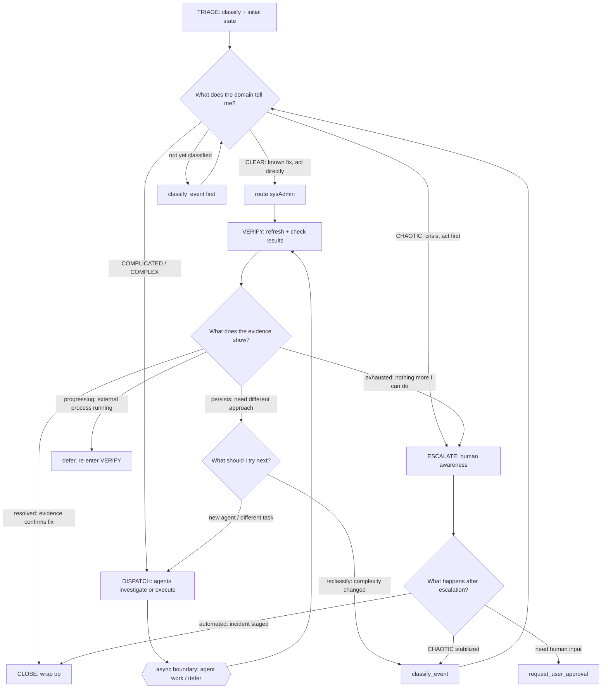
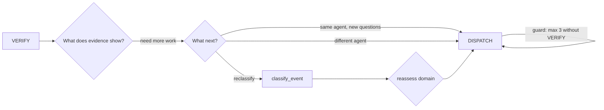
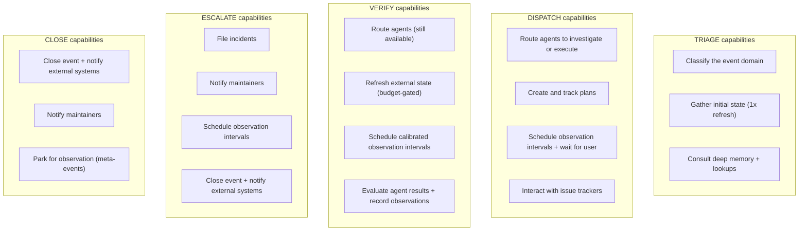
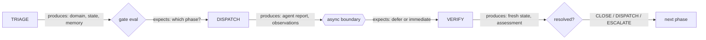
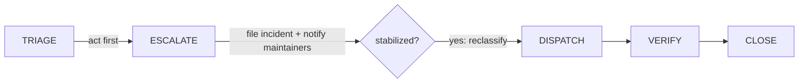

# Phase Pipeline

This phase pipeline is executed by the domain control loops in 03-control-theory.md.
Phases unlock capabilities; domain strategy decides which path you walk through them.
Transition phases to unlock the capabilities for your next action — the domain loop
decides WHAT to do; the phase decides WHAT CAPABILITIES you can use to do it.

## Pipeline Flow

## Iteration Rules

CLOSE is terminal. Reopen requires a new event.

## Capabilities Per Phase

Core capabilities (lookups, classification, phase transitions, agent routing,
plan management, agent communication) are available in ALL phases. The diagram
shows phase-specific unlocks only.

**Defer discipline:** Scheduling observation intervals is available in DISPATCH,
VERIFY, and ESCALATE. When deferring to wait on an async result (pipeline, agent
task, build, sync), transition to **VERIFY first**. Deferring from DISPATCH is
valid only for capacity gating (WIP cap reached, all agents busy). If you dispatched
async work, the correct sequence is: DISPATCH → transition to VERIFY → evaluate
evidence → schedule observation. Skipping VERIFY means you defer on stale state.

## Phase Handoffs

## Refresh Budget

Refreshing external state uses an event-scoped budget, not phase gating.
You start with 3 tokens per event. Each use consumes one. Tokens refill
when an agent returns results (new evidence justifies a fresh check).
Budget is capped at 10 to prevent unbounded accumulation on long-running
events.

You do not need to transition phases to refresh. If tokens are exhausted
without agent work in between, dispatch an agent rather than refreshing
stale state repeatedly.

Fetching issue tracker data is phase-gated (available in triage, dispatch,
and verify) but does not consume refresh budget tokens.

## Why Phases Matter

Agent work takes minutes to hours. The world changes -- pipelines recover,
MRs merge, humans fix issues, outages end. VERIFY after every async
boundary catches these changes before you escalate on stale data.

Two kinds of state: the **symptom** (resource showing Failed) and the
**cause** (outage, permission gap, missing dependency). Refreshing verifies
the symptom. The cause has its own lifecycle.

## External Processes

Pipelines, deployments, and recovery run on their own schedule. Checking
more often does not make them finish faster. If current state is "still in
progress," defer -- the situation requires time, not another check.

## Automated Events

No human in the loop. You are the sole controller. VERIFY is the only
checkpoint before a human is disturbed. Noisy escalations that self-resolved
erode trust. Always VERIFY before ESCALATE for automated events.

## CHAOTIC Events

Closing and deferring are not available in CHAOTIC domain. Reclassify to
COMPLICATED first. The act-first principle overrides verify-before-escalate.

## After Escalation

- **Automated events:** CLOSE. Incident is an offline artifact for business hours.
- **FRIDAY needs input:** request user approval after escalating. Human responds
  via dashboard or chat. If event closes before reply, follow-up event created.

## System States

System states (agent working, waiting for user) are handled automatically.
Your declared phase resumes when the system state clears. New capabilities
are available on the next processing turn after a phase transition.
