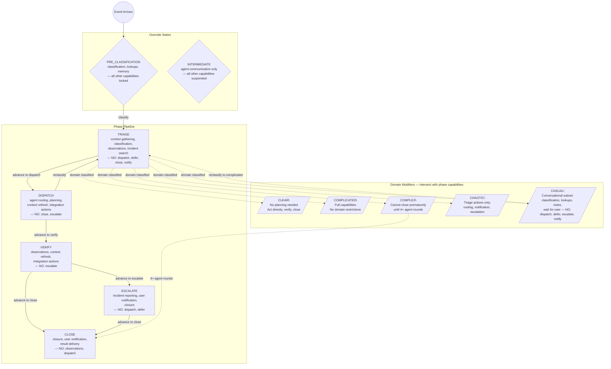

# Phase×Domain Navigation Map

> Exact tool availability is enforced at runtime by the gate system. This map shows the capability topology — use it to navigate toward the right phase for your intent.

## Transition Skill Pointers

| Transition | Pointer |
|---|---|
| Enter triage | <skill id="always/06-decision-guidelines.md"/> |
| Enter dispatch | <skill id="dispatch/decision-routing.md"/> |
| Enter verify | <skill id="always/03-control-theory.md"/> |
| Enter escalate | <skill id="escalate/incident-tracking.md"/> |
| Domain loaded | <skill id="domain/{domain}.md"/> |
| Source loaded | <skill id="source/{source}.md"/> |

## Conditional Gates (state-dependent)

| Gate | Condition | Effect |
|---|---|---|
| BUDGET_EXHAUSTED | refresh count exceeds budget | context refresh capabilities removed |
| NO_KARGO_CONTEXT | no kargo evidence present | kargo refresh removed |
| DEFER_WAKE_ITER0 | first cycle after wake | deferral blocked |
| HARD_STRIP_DEFER | triage OR jarvis source | deferral blocked |
| HARD_STRIP_WAIT_USER | triage OR non-user source | user-wait blocked |

## Behavioral Annotations

- Agent progress: wait for completion — don't act on intermediates
- Notification authority: YOU are the sole notification channel to users
- Action sequencing: one action per turn, verify result before next
- Route vs message: dispatch = full work package, message = coordination
- Authorization boundary: autonomous actions vs human-gated fixes
