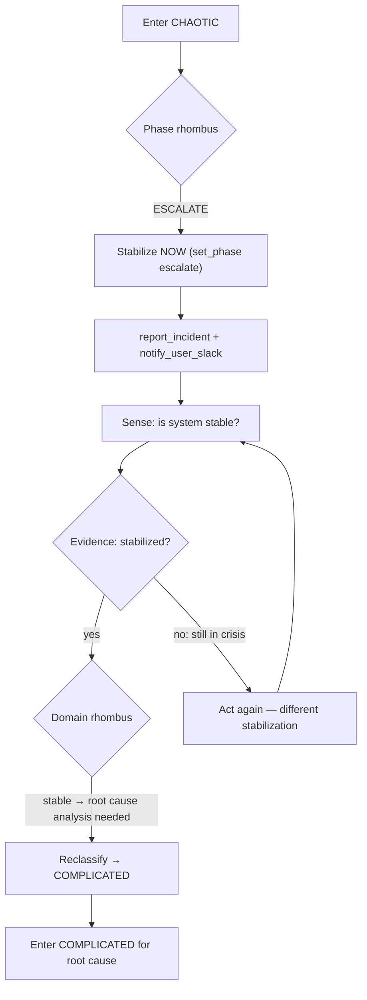

# CHAOTIC: Act → Sense → Stabilize

Crisis. No time for analysis. Cause and effect are indecipherable.
Stabilize the system first. Everything else follows.

<source_context ref="source/{event.source}">
Stabilization principles:
- Act on the most reversible high-impact lever first (scale, disable, rollback)
- Contain blast radius before diagnosing root cause
- If a human is present, they are a live witness — escalate to them immediately
- Every stabilization action must be logged as an observation for the post-mortem
</source_context>

## Control Loop

<agent_feedback ref="post-agent/agent-recommendations" trigger="agent_return">
Did stabilization work? Binary: stable / not stable.
If stable → reclassify to COMPLICATED for root cause.
If not stable → act again with a different approach.
</agent_feedback>

Phase restrictions (closing, deferring) and close criteria for CHAOTIC domain:
see always/09-phase-lifecycle.md § CHAOTIC Events.
