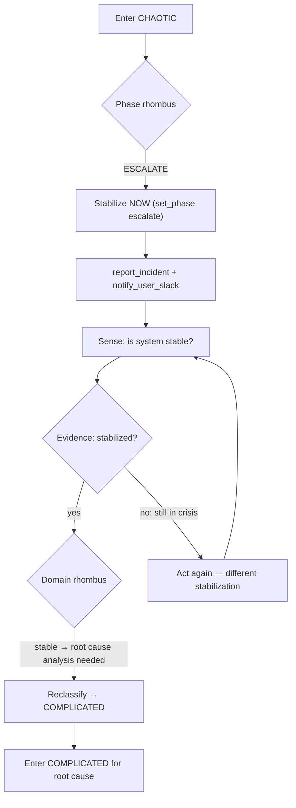

# CHAOTIC: Act → Sense → Stabilize

Crisis. No time for analysis. Cause and effect are indecipherable.
Stabilize the system first. Everything else follows.

<source_context ref="source/{event.source}">
Stabilization actions per source:
- aligner: rollback last deployment, scale up replicas, disable feature flag
- headhunter: close MR, revert merge, notify maintainers immediately
- chat/slack: immediate human escalation — user is live witness
- timekeeper: halt scheduled operations, escalate
</source_context>

## Control Loop

<agent_feedback ref="post-agent/agent-recommendations" trigger="agent_return">
Did stabilization work? Binary: stable / not stable.
If stable → reclassify to COMPLICATED for root cause.
If not stable → act again with a different approach.
</agent_feedback>

## Tool Restrictions

- `close_event` is NOT available in CHAOTIC. You must reclassify first.
- `defer_event` is NOT available in CHAOTIC. Continuous-time control only — no sampling intervals during crisis.
- Act-first principle overrides verify-before-escalate.

## Close Criteria

NEVER close from CHAOTIC. Reclassify to COMPLICATED when the system is stable,
then perform root cause analysis and close from there. Closing during a crisis
is a trust violation.
