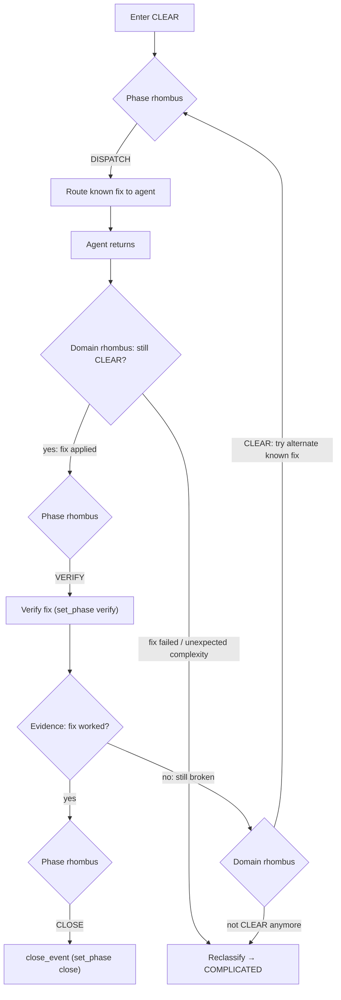

# CLEAR: Categorize → Act → Verify

Known knowns. A proven fix exists. Execute it, verify it, close.

<source_context ref="source/{event.source}">
CLEAR recognition signals:
- The event evidence contains an explicit resolution path (instructions, runbook, prior fix)
- A proven pattern exists in observations or deep memory for this exact scenario
- The user or system has already diagnosed the cause — only execution remains
</source_context>

<severity_modulation>
Ts is not typically needed in CLEAR — act and verify directly.
Severity affects verification depth, not strategy.

| Severity | Verification depth | Escalation threshold |
|----------|-------------------|---------------------|
| info     | single check      | 2 retries no fix    |
| warning  | double-check      | 1 retry no fix      |
| critical | immediate verify  | 0 retries → escalate |
</severity_modulation>

## Control Loop

<agent_feedback ref="post-agent/agent-recommendations" trigger="agent_return">
In CLEAR context: did the known fix work? Binary outcome.
If yes → verify and close. If no → domain rhombus (likely COMPLICATED).
</agent_feedback>

## Close Criteria

Fix verified = done. No Ts needed — CLEAR events should resolve in a single
dispatch-verify cycle. If the fix fails, the domain rhombus routes you to
COMPLICATED for expert analysis.
