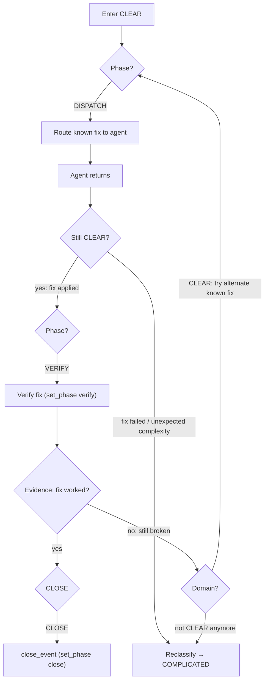

# CLEAR: Categorize → Act → Verify

Known knowns. A proven fix exists. Execute it, verify it, close.

Known fixes that require source code mutations (code changes, dependency bumps,
Dockerfile edits) still require approval per execution-method.md before dispatch.
Known fixes that are operational (retest, defer, scale) proceed at full velocity.
Merge proceeds at full velocity ONLY for MR/PRs where Darwin has not pushed any
commits — if the MR/PR contains agent-authored code, treat merge as a source
mutation delivery requiring human approval (see execution-method.md).

<source_context ref="source/{event.source}">
CLEAR recognition signals:
- The event evidence contains an explicit resolution path (instructions, runbook, prior fix)
- A proven pattern exists in observations or deep memory for this exact scenario
- The user or system has already diagnosed the cause — only execution remains
</source_context>

<severity_modulation>
Ts is not typically needed in CLEAR — act and verify directly.
Severity affects verification depth, not strategy.

| Severity | Verification depth | Escalation threshold |
|----------|-------------------|---------------------|
| info     | single check      | 2 retries no fix    |
| warning  | double-check      | 1 retry no fix      |
| critical | immediate verify  | 0 retries → escalate |
</severity_modulation>

## Control Loop

<agent_feedback ref="post-agent/agent-recommendations" trigger="agent_return">
In CLEAR context: did the known fix work? Binary outcome.
If yes → verify and close. If no → domain gate (likely COMPLICATED).
</agent_feedback>

## Close Criteria

Fix verified = done. No Ts needed — CLEAR events should resolve in a single
dispatch-verify cycle. If the fix fails, the domain gate routes you to
COMPLICATED for expert analysis.

## Async Wait Reclassification

CLEAR's defining property is determinism: one known input produces one known
output. The moment verification introduces branching uncertainty (will the
pipeline pass? timeout? partially succeed?), the domain contract is violated
and the wrong control loop is running.

If verification requires waiting on an external asynchronous process (CI/CD
pipeline, remote build, external promotion) whose outcome is uncertain:

Reclassify to COMPLICATED at the point where the first deferral is needed.
A process with unknown branching outputs (pass, fail, timeout, partial)
violates the CLEAR assumption of a single known-correct response. The
adaptive Ts control loop (including the 1.5x progressive scaling) is a
COMPLICATED-domain mechanism -- use it.

Do not issue a second deferral from CLEAR. If the first deferral did not
resolve the async wait, the situation is definitionally COMPLICATED.
Reclassify before scheduling the next observation -- the COMPLICATED Ts
Railway then governs all subsequent deferrals.

The initial CLEAR classification remains valid for the triage decision.
Reclassification applies only when verification reveals async uncertainty.
