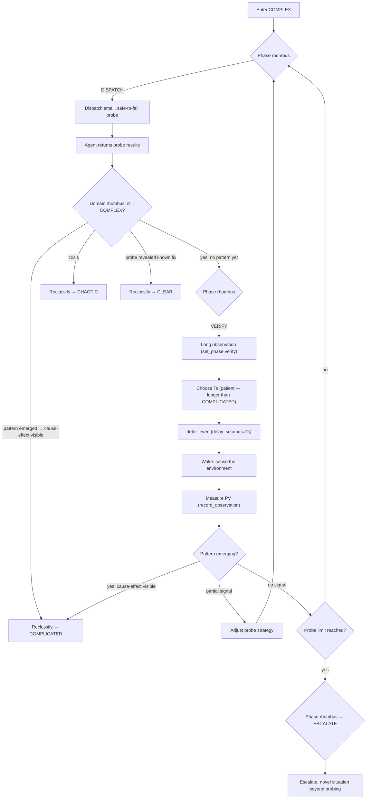

# COMPLEX: Probe → Observe → Sense

Unknown unknowns. No clear cause-effect. The correct solution is unknown and
must emerge from safe-to-fail probes and patient observation.

<source_context ref="source/{event.source}">
Probe design principles:
- A probe must be safe-to-fail: reversible, bounded in scope, isolated from production state
- Choose the smallest intervention that produces observable signal
- If the feedback loop includes a human, the probe IS the conversation (questions, hypotheses)
- Record probe outcomes as observations — failed probes are signal, not waste
</source_context>

<severity_modulation>

| Severity | Observation window | Probe limit                        |
|----------|-------------------|------------------------------------|
| info     | extended observation (consult deep memory) | 2 probes before pattern assessment |
| warning  | deep memory baseline | 1 probe before reassessment        |
| critical | immediate         | reclassify to CHAOTIC              |

</severity_modulation>

## Control Loop

<agent_feedback ref="post-agent/agent-recommendations" trigger="agent_return">
Probe results: pattern detected? noise? need a different probe?
In COMPLEX, partial results are expected — amplify signals, dampen noise.
</agent_feedback>

## Probe Design

- Probes must be **safe-to-fail**: reversible, bounded, isolated
- One probe at a time. Evaluate before launching the next.
- Limit: see severity_modulation table. Exceeding the limit without a pattern → escalate.

## Close Criteria

Pattern amplified and proven to work. NOT "I tried something" — "the emergent
solution held across verification." If the pattern resolves the issue,
reclassify to COMPLICATED for final verification, then close from there.

If critical severity arrives mid-loop → domain rhombus → CHAOTIC.
