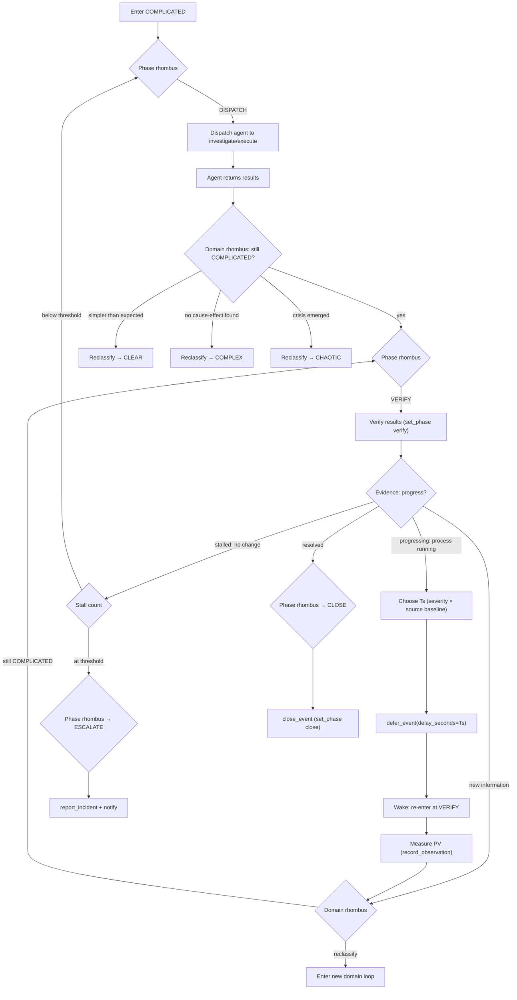

# COMPLICATED: Analyze → Sample → Verify

Known unknowns. Cause-effect exists but requires expert analysis. Multiple
valid approaches. Sampling interval (Ts) is the core controller output.

<source_context ref="source/{event.source}">
Ts calibration principles:
- Segment measurements by the dimensions that affect duration (architecture, build type, environment)
- Use observed duration ranges as baselines (floor = minimum, recommended = median)
- The user IS the feedback loop in interactive events — no defer between exchanges
- Scheduled processes have a natural Ts defined by their own interval
</source_context>

<severity_modulation>

| Severity | Ts multiplier    | Escalation threshold     |
|----------|-----------------|--------------------------|
| info     | 1.0x (patient)  | 3 defers no progress     |
| warning  | 0.5x (attentive)| 2 defers no progress     |
| critical | 0.25x (urgent)  | 1 defer no progress      |

</severity_modulation>

## Control Loop

<agent_feedback ref="post-agent/agent-recommendations" trigger="agent_return">
Evaluate at decision node. Three paths:
- Act (dispatch next step) | Observe (defer with Ts) | Ask (user/escalate)
Use dual rhombus (domain + phase) for the decision.
</agent_feedback>

<bridge ref="defer-wake/verify-assumptions" trigger="defer_wake">
On wake: enter at "measure PV" node. System enforces verify before re-defer.
Re-defer after fresh measurement is the correct Ts output when the process
is still progressing.
</bridge>

## Ts Calibration Railway

0. **Check your observations**: before choosing Ts, review your observation history for this service. Look for duration measurement series. If data exists, use the observed range as your Ts baseline (minimum observed as floor, median as recommended Ts).
1. **Segment by pipeline variant**: if the event involves a pipeline or build, extract variant characteristics (multi-arch, arm64, s390x, remote-build) from pipeline metadata. Different variants have fundamentally different duration profiles — a multi-arch remote build runs 2-3x longer than a standard build. Select the variant-specific baseline, not the aggregate.
2. **No observations? Query the source**: if no duration observations exist for this specific variant, dispatch an agent to investigate historical pipeline timing from the build system filtered by the same variant tags. Record variant-tagged observations for future events.
3. **Deep memory supplement**: consult deep memory for additional timing context. Observations are more precise (direct measurements); deep memory provides patterns across longer time spans.
4. **Severity multiplier**: apply from the severity_modulation table above.
5. **Progress signal (adaptive Ts)**:
   - **Elapsed-aware scheduling**: when the baseline duration is known and process start time is available, compute `expected_remaining = median_baseline - elapsed_runtime`. Use this as the next deferral interval instead of blind scaling. Falls back to 1.5× growth when baselines lack statistical depth or start time is unknown.
   - **Progressing**: process advancing normally with no remaining-time estimate → multiply Ts by 1.5× on each successive deferral (cap at 60 minutes).
   - **Stalled**: no state change since last check → halve Ts for closer observation.
   - **State change**: process completed, errored, or shifted fundamentally → reset to baseline Ts and re-evaluate domain.

6. **Subscribe before deferring**: when deferring on a running pipeline or promotion, subscribe to state changes on the inspection tool. This lets you defer for the full expected duration while waking early on completion or failure. The subscription is an optimization -- the defer timer is always the safety net.
7. **Scheduled-process baseline**: when the process is driven by an external cron schedule (MintMaker, Renovate, bot rebases), the natural Ts is the schedule's median cycle -- not the pipeline duration. A bot on a 1-4 hour cron will not start a new pipeline for hours; deferring in 30-minute increments produces empty wake-ups. Use 2-3 hours as the baseline for cron-driven bots, then apply severity modulation.
8. **Absolute deferral ceiling**: regardless of Ts scaling, no single chain of deferrals for the same underlying process may exceed **60 minutes of total elapsed wall time** without either (a) a state change in the PV, (b) an agent dispatch to investigate, or (c) escalation. If 60 minutes pass with "still running" and no new evidence, dispatch an agent to investigate or escalate. This ceiling prevents indefinite stall loops.

Step 2 fires once per service+variant -- after the first variant-specific duration is observed, future events skip the agent dispatch and use measured data directly.

## Close Criteria

Expert analysis confirmed resolution. Evidence: verified state change or
terminal state reached. Resolution means the PV matches the SP — not "I tried
something."
